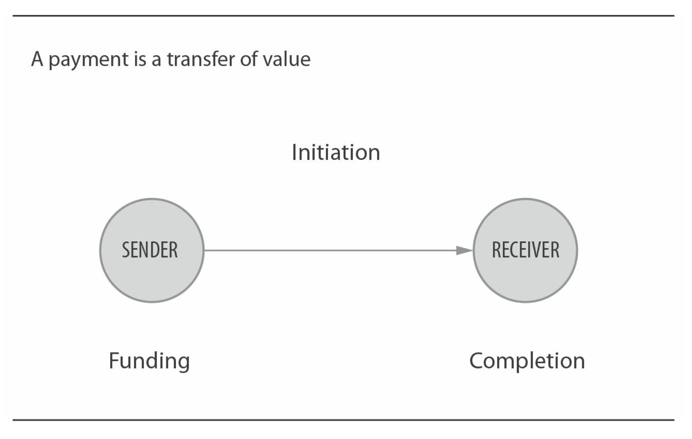
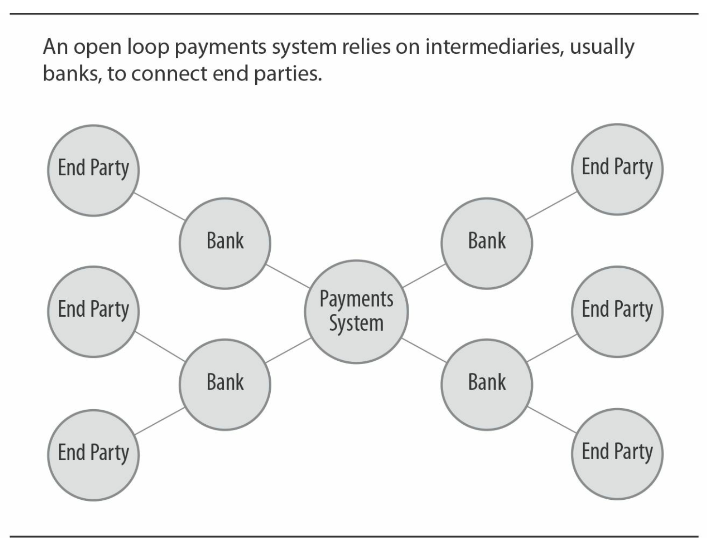
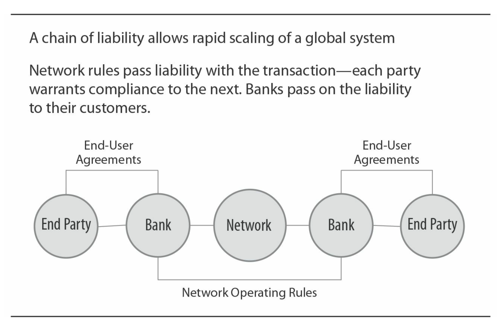
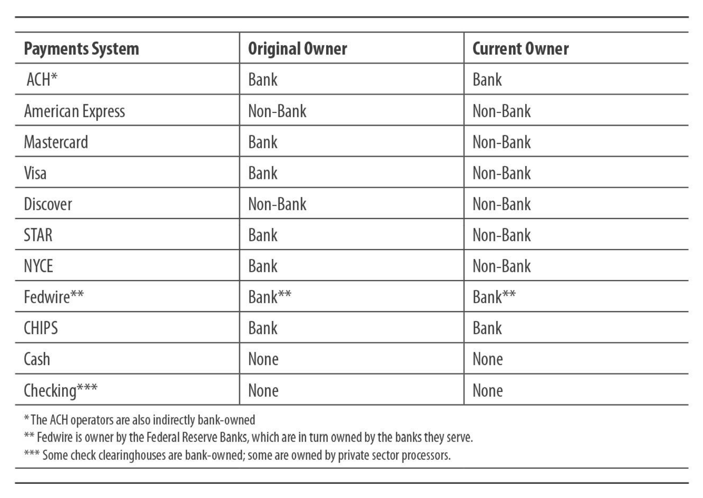
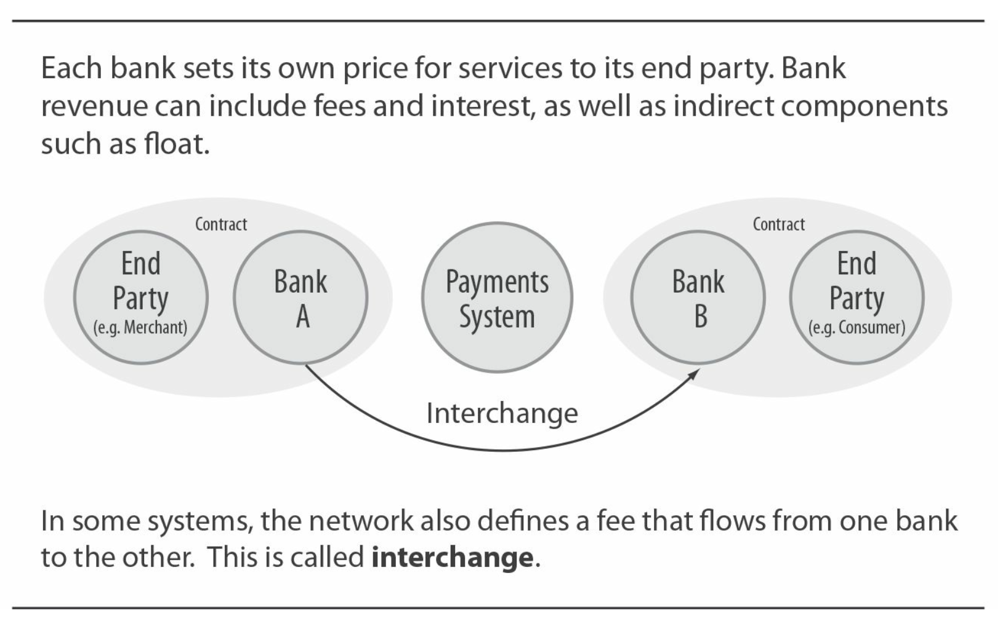
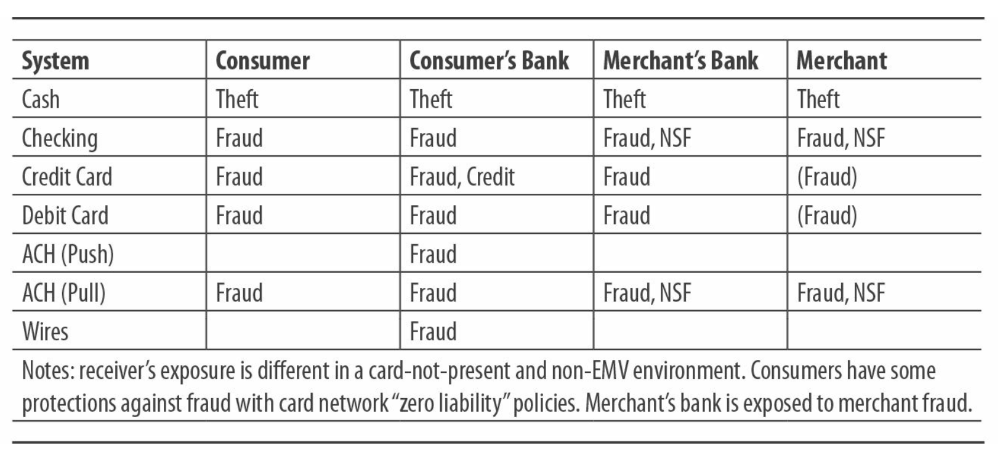

# 支付系统综述

什么是支付？ 支付是价值从一个终端用户(发送者)转账到另一个（接受者）。

转账的价值的为特定的币种，通常是国家支付系统的法定币种。 支付转账中有3个元素：支付的发起，发送方提供资金，交付款项给接收方。 在某些系统中，接收方发起支付。 另一些由发送方发起。 从发起到完成可能经过数秒， 或4到7个工作日。 这取决于系统。

一个支付系统，如下图所示，决定如何转账并系统的用户提供规则框架。

存在许多类型的支付系统，它们有以下共性：
- 在单个国家的国家级别执行
- 采用该国的法定币种
- 直接或间接的受制于国家政府的监管
- 使参与方能互相交互

## 支付系统模型

支付系统能在多种模型下运转。 最常见的两种叫开放模型和闭环模型。 也有一些混血模型糅合了两种模型的特质。

## 开放系统

开放系统在一种轴辐式（hub and spoke）模型下运转。 几乎所有大型支付系统使用这种模型。 一个开放系统需要中间人（几乎都是银行或金融存款机构）加入。 这些中间人然后会去终端客户（比如消费者或商家）结成商业关系。

一笔交易会由一个终端用户转账给她或他的银行，然后是支付系统，然后是另一方终端用户的银行，最后是另一端终端用户。 该结构允许两个终端用户在无需与对方的银行发生直接关系的情况下交互。 同理，银行也无需发生直接交互。

今天大部分电子化交易系统包含纸质化基础的和全电子化的（卡，ACH，电汇，支票图像）都在这个模型下运转。当下的技术可以很轻松的允许双向的电子交易。但我们将会看到开放模型同时会产生有效的责任分配链条。

开放结构的优点是它允许支付系统能够快速的扩张。所有的终端用户都能够间接的访问系统中的其他中间商。

开放支付系统中,支付网络定义了参与银行的操作规则。接着银行必须保证它的用户遵守守则。这创造了一个责任链：

## 开放系统和责任链

开放系统中，中间商和支付网络会确保他们客户行为的责任，以及他们自己的行为。这些责任及其扩展是由支付系统的操作规则决定的，并且在某些情况下，是由国家法律和法规决定的。

举个例子，在自动清算系统中，对于一笔ACH收款的发起银行必须取得用户对于他或她的账户的使用权。如果用户成功对一笔交易发起争议，发起银行必须补偿给用户的银行账户。

发起银行当然也会尝试着从它的客户那边收回该笔款项，但如果没成功，银行只好独自承担责任。

类似的在卡组织中，如果一个商家的客户发起争议要求撤回一笔交易，收单银行对于这个客户在支付网络中是最终责任方。

## 闭环系统

闭环支付系统中没有中间商。 终端用户直接与支付系统交互。最开始的美国运通和Discover，还有专有卡系统（比如梅西百货的信用卡只能在梅西百货用）都是闭环系统的列子，虽然他没有些可以访问开放系统来完成交易。

闭环系统的优点是简单。一个实体设置所有的规则并直接与终端用户交互，这使它比分布式开放系统能更快更灵活，开放系统的改变需要在系统的中间层传播。闭环系统的缺点它没法成长起来比开放系统难，它必须亲自签约每一个终端用户。

就如我们将在第五章[核心系统：卡](ch5.md)中看到的，一些闭环的卡支付系统正处于进化成开放模型的过程中。

支付服务提供商，如PayPal或西联汇款，是闭环系统。但值得注意的是这些提供商它们自己就是开放系统的用户，起来一个聚合的作用。它们使用开放系统从发送方处为交易提供资金，并转账给接收方。

## 起源：支票票据交换所

最早在1800年代成立，支票票据交换所是美国第一个大型的开放支付系统。在它成立之前，每个银行收到其他银行的存款支票后都需要把支票直接呈现给开出此支票的银行来收取真正的付款。

当支票的使用体量增大后，需要一个复杂的网络来处理城市中银行的双向关系。清算一个其他城市的支票会更加复杂，通常需要一个或多个代理行来促成支付。

最早的支票票据交换所是一种简单的由城市中所有参与银行的代表举行的会议，在每个工作日早上。每个银行的记账员会带着许多装着支票的袋子。在支票票据交换所，支票将被交换，每个记账员会在自家的银行账号上为支票记账（有趣的是在银行卡系统的早期，纸质的“sales drafts”也是由同样的方式清算的）。下面是个1883年的交换所列子。

## 开放支付系统中的其他术语

On-us交易 指交易的双方是同一家银行的时候。根据不同的支付系统，这笔交易可能只在银行内部发生（不会被提交到清算所或其他的中心节点），银行结算的时候只是在内部记了一笔账。也可能在其他的系统中，这笔交易会流经支付系统然后回到银行，和其他的普通交易一样。随着美国银行越来越集中，on-us交易的比例也越来越大。

代理银行关系 银行间的代理关系使得不在支付系统中的小银行也能依靠系统中的参与银行来访问系统。美国的许多小银行是靠着这种方式来访问电汇系统。在跨境支付中也大量使用该模式。

## 美国支付系统

在美国共有五种核心支付系统：

 * 现金
 * 支票
 * 银行卡（签账卡，信用卡，借记卡，预付卡）
 * 自动清算所
 * 电汇

如我们将在第十章讨论的[支付创新](ch10.md)，有许多方式来完成支付，包括线上银行/账单支付，其他产品如电邮和移动电话支付服务。几乎所有这些方法都依赖于一个或多个核心支付系统来真正转钱。当我们写书的时候，美国和其他国家正在建立一种新的支付系统，“immediate funds transfer”, or “转数快FPS（faster payments）” system.

## 术语

在本书中，我们用“终端用户”来指代资金的发送方和接收方。一个终端用户可以是消费者，或商家，或企业（开票人，小商家，政府，非盈利组织）。在任何支付交易中，一方是付款方，一方是接收方。我们将会看到，付款方或接收方都可以发起支付交易，取决于支付系统和支付类型。

我们使用“提供商”来指代那些为终端用户和其他提供商提供对支付系统的访问的实体。银行，支付网络，清算所，processors and service providers 都是提供商的类型。最后，我们用“银行”来指代美国的金融存款机构，包括信用合作社，储蓄所和储蓄银行。

我们使用“支付系统”来指代一群遵守共同协议和规则的提供商。“支付网络”指代制定并维护网络规则的特殊的组织。所以我们会称呼“卡支付系统”和“万事达支付网络”。在其他国家，我们称之为支付网络的有时被叫做“scheme”。

## 支付系统量级

支付系统量级可以用两种方法来丈量：交易笔数和交易金额。“笔数”指交易处理的数量，“金额”指交易的总金额（在银行卡系统中，用“volumn”指代金额）。

某些系统比其他系统更善于统计自己。比如电汇系统和一些银行卡系统就有相当精确的统计。但支票，特别是现金，就没有正式机制来进行精确的国家级别统计，所以只能简单的估计。波士顿的联邦储备银行有一个关于“消费者支付选择问卷”，周期性的调查数千消费者。这个问卷把银行卡类型分成信用卡，借记卡，预付卡。

下表展示了Glenbrook对2015年美国支付系统量级总交易百分比的估计。

注意到电汇被排除掉了。如果包括了电汇，电汇将占到不到1%的总笔数，但是93%的总金额，因为大笔金融交易市场通常使用电汇。图上的总量很大，比美国的国民生产总值大的多。因为一笔简单的交易（比如消费者购买）能产生多笔支付，因为在支付链上的多方会参与支付，结算等。

## 支付系统功能

支付系统提供三项关键功能：处理，规则，品牌（brand）。一些支付系统靠单一组织提供这三种功能。其他的靠虚拟的或分布的模型来达成。

处理意味着交换--一笔交易从一个参与方到另一个。在闭环系统中，发生在两个终端用户间。在开放系统中，转账发生在中间商间（代理它们的终端用户）。处理也包括结算-中间商转账价值（通常是聚合的）来涵盖它之前参与的每笔交易。

规则（操作规则或操作规定）约束系统中的参与方。在开放系统中，规则约束中间商。规则虽然没法直接约束终端用户，但规则要求中间商约束它们的终端用户一些事情。在闭环系统，规则直接约束终端用户。

品牌是一笔交易的参与方彼此交流如何进行支付。在银行卡网路中，重要的品牌广告一直是支付系统增长的重要驱动力。

## 支付领域

支付用于多种目的。我们将之分成六个领域，每个都有独特的特征和要求：

 * **POS机** 支付是在销售现场完成。包括商店和餐厅的付款，也包括一些自动售货机和运输亭等无人值守的环境。POS付款有时也称为近端支付。
 * **远程商务** 买家离卖家很远的支付场景。包括在线和手机购物，以及邮件订单或电话订单。关键部分包括电子零售，在线旅行和娱乐，数字订阅和数字内容。
 * **账单缴费** 个人或企业根据帐单收据进行的付款。 包括定期支付的水电，保险和服务（个人或企业）。
 * **P2P付款** 个人对个人付款。 包括境内朋友和家人之间的家庭付款，还包括跨境汇款（例如，移民工人向本国亲戚汇款），以及个人之间账户到帐户的转帐。
 * **B2B付款** 商家对商家付款。 包括从买方到供应商的付款，还包括公司内部付款，以及重要的金融市场付款（银行对银行付款，证券购买，外汇交易等）。 政府，非营利组织和其他类型的企业均被列为“商家”。
 * **收入支付** 向个人支付工资，福利，折扣和费用报销。

 支付系统支持这些支付领域的活动，并且实际上在系统级别上相互竞争。

 一个很好的例子就是B2B支付领域，用于企业对企业的传统支付系统支票正在衰落。 所有电子支付系统都在争夺历史上使用支票的B2B付款场景。 ACH系统对于B2B付款具有专门的交易代码
，并随汇款一起携带汇款数据。 银行卡系统具有商务购买卡以及小型企业的信用卡和借记卡产品。 电汇系统正在增强其网络以承载汇款数据，以满足该领域的要求。

同时，支票系统本身通过识别系统，远程存款捕获和其他进步，加强竞争力以保持交易量。

## 支付系统流畅

开环支付系统中的交换功能是从第一中间商到网络（在集中式模型中可以是支付系统本身，在分布式模型中可以是中间节点或清算所），到第二中间商的消息流。 此消息始终沿相同方向流动。 但是，根据付款是“推”还是“拉”，消息的内容是不同的。
虽然“推”和“拉”付款的概念可能令人困惑，但对了解支付系统的工作原理，尤其是交易各方承担的风险和责任至关重要。
“推”或“拉”是指将交易发起方的行为。 推式和拉式付款如下图所示：

 * 每当“A”向“B”汇款时，都被视为推模式，例如电汇或ACH直接存入工资单。 以存款为例，我们看到雇主（“A”）正在指示其银行通过ACH网络向员工汇款。 实际上，第一家银行对第二家银行说：“我在扣款，你应该入账。”
 * 当“A”从“B”收取款项时，被视为拉模式。 支票，银行卡和ACH借记交易均为拉模式。 以支票为例，我们看到商家（“A”）通过存入支票，指示其银行通过清算该支票，以从“B”（支票开具人）收取款项。 实际上，第一家银行对第二家银行说：“我在入账，你应该扣款。”

考虑到推拉模式涉及到不同的各方来发起付款，因此有必要了解各方需要知道哪些信息来发起付款。

## 支付与风险

从根本上来说，“推”的风险要比“拉”的风险小得多。 在“推”模式中，有资金的一方正在汇款，因此基本上没有NSF（资金不足）的风险-“推”模式不会“拒付”。 此外，在“推”模式中，交易是由发起方的银行发起的，发起方的银行知道账户有钱。 当然，其他类型的欺诈风险仍然有可能。

“推”模式会有“拒付”的风险。 发起该交易的银行不知道接收该交易的银行是否能够将该交易成功地应用于其客户的贷方或借方帐户。 此外，“拉”模式交易取决于付款人（“B”）是否已授权“发送方”进行交易。 （提供给商家的签名支票，或刷卡并签名或PIN密码就是这种授权的示例。）

银行卡网络从根本上说是“拉”模式。 银行卡付款不会拒付-但这并不意味着它们是推模式。 它们是有保证的“拉”模式。 银行卡网络通过添加称为“授权”的功能来实现，授权发生在真正的“拉”之前。 授权动作会询问：“是否有足够的资金或可用的信贷余额来支付此交易？” 如果是这样，则提交“拉”交易。 银行卡网络规则规定，收到“是”答复的商户将受到保障免除资金不足和欺诈的风险。 （在电子商务和其他不使用实体银行卡的场景下的不同点将在[第5章](ch5.md)和[第8章](ch8.md)中进行讨论。）

支付系统中的数据泄露通常是盗用了付款人帐户凭据（例如卡号）：被盗的凭据可用于从帐户中提取资金。 在银行卡系统中，令牌化是解决这一风险的一项重要举措。 但有趣的是，“推”模式下不一定存在类似的风险：如果收款人的凭证只能用于“推”钱，那么这些凭证的盗窃就不会造成危害（译注：没法拉钱）。

## 支付系统结算

开环系统中的结算是指中间商真正意义上接收或发送资金的过程。 开环系统中的结算功能可以是实时或净额结算：

* 在净额结算系统中，支付系统会定期（最通常是每天）计算参与中间商的净额债务。 在一天结束时，向参与的中间商提供净额结算总额，并指示（a）如果处于借方头寸，则以该金额为结算账户提供资金，或（b）如果它处于贷方头寸，并有足够资金，则从其结算帐户中提取资金。
* 支票，银行卡和ACH都是美国的净额结算系统。 例如，通过美联储银行处理的支票和ACH的结算是批处理进行的：定期从一批已处理的交易中将总金额贷记或借记在美联储银行的银行帐户中。
* 系统的规则规定了参与银行在其结算帐户中是否可以欠款，以及欠款到什么程度。 此欠款是参与银行的负债，如未能兑现该债务（例如，如果银行在结算期间关闭）则对支付系统造成了一项义务： 系统规则将规定如何处理该义务。
* 在实时结算系统中，每笔交易在处理时实时结算。 例如，在Fedwire系统中，当发送方在美联储银行的帐户是借方而在收款人在美联储银行的账户是贷方时，交易将实时生效。 在实时结算系统中，无需在一天的最后进行结算。

终端用户的结算方式取决于支付系统。贷记或借记到消费者，商人或企业帐户的时间和方式取决于支付系统，法规或银行和用户之间的市场实践。

在闭环系统中，唯一的结算方式是终端用户结算。 支付系统的操作员定义如何处理此类结算。

## “结算方式的新世界”

在世界上许多国家，跨银行间净额结算的方式正在发生重大变化。 结算周期正在缩短：每隔几小时或几分钟，或者在达到一定数量的交易金额时，就可以进行结算，而不是在工作日结束时。

与其允许银行透支其结算帐户，某些系统正在朝着要求参与银行需要预付资金的方向发展，他们必须在帐户中已经有足够的资金来处理交易。

最后，一些系统正在朝着允许非银行实体直接访问核心支付系统以及支持这些系统的结算服务商。 非银行机构是在一个国家/地区内特许并经国家法律允许进行某些类型的支付交易的机构。 美国尚未在其核心系统中采用这些变化。

## 虚拟系统

美国的两个核心支付系统现金和支票，它们是虚拟运行的。我们的意思是说，没有正式的支付系统可以让终端用户或银行中间商“加入”。

当然，我们都知道现金是如何运作的。交易直接在两个用户之间“交换”和“结算”。从这个角度来看，它是一个推送系统。现金支付的其他方面在[第6章](ch6.md)中介绍。

美国的支票系统自动包括所有金融存款机构，它们不必“加入”。但是，银行通常会加入一个或多个清算所，以交换和清算他们在用户存款行为中收到的支票。清算所有规则，但是这些规则相对于银行卡或ACH网络的规则要受限制得多。在某种程度上，这是因为美国对纸质支票的法律法规更广泛。支票的其他方面在[第3章](ch3.md)中介绍。

这些虚拟系统没有大品牌，也没有中央网络推广它们的使用。

## 支付系统所有权和法规

### 所有权

美国大多数支付系统开始都是由银行拥有的。 如下表所示，在过去的十年中，许多此类支付系统已迁移到不同的所有权模型。 一些非银行所有的支付系统是上市公司。 其他则由私人持有。

大型银行拥有的支付系统往往会制定使银行整体受益的规则。 这可以起到“公平竞争”的作用-所有参与的银行都可以平等地使用产品和服务。 员工和广告预算很高的系统（尤其是银行卡网络）会创建全新定义的产品，然后由成员银行分发给其客户。 预算较小的系统（例如ACH）在产品定义和管理方面的作用要小得多，并且仅提供操作规则和银行随后用来创建产品的平台。

### 法规

政府法规和私有法规的结合规范了美国的支付系统。 当然，政府的规则是由法律和政府机构为实施这些法律而发布的法规组成。 在美国，支付法规的主要发布者是联邦储备委员会。 私有规则可以是网络规则，也可以是服务的简单合同：联邦储备银行的运营通函（管辖向银行提供的联邦储备银行支付服务）就是一个例子。 私有规则可以被认为是“基于协议的”。

### 私有系统规则

大多数支付系统需要中间商（开环系统）或终端用户（闭环系统）正式加入系统。 加入系统的一方受系统规则的约束。 在开环系统中，中间商与终端用户的合同通常包含系统规则所规定的条款，从而使终端用户间受某些系统规则支配。 这些操作规则非常重要，特别是对于开环网络而言，因为它们定义了成千上万个终端用户之间成功进行交互操作性所必需的条件。

操作规则涵盖了广泛的主题，包括：

 * **技术标准** 数据格式，令牌（例如卡）规范，传递和接收功能，数据安全标准等。
 * **处理标准** 提交和返回交易的时间限制，向终端用户帐户过帐的要求等。
 * **成员资格要求** 可以加入的机构类型，资本要求等。
 * **付款接受要求** 限制能接受的支付交易。
 * **异常处理和争议解决** 中间商和终端用户的权利和要求，通常是在争议或拒绝交易方面。
 * **费用** 支付给支付系统的处理费和其他费用； 中间商之间的手续费（如果有）。
 * **品牌和商标** 支付系统品牌使用标准。

 支付系统级别的新产品（例如，非接触式卡）或新的交易类型通常需要适用于该特定产品或交易类型的一组新的操作规则。 操作规则要求可能会对支付系统的用户和提供者产生重大的财务影响。 投资者可能需要达到技术标准或提供某些形式的服务，如争议解决机制； 责任定义的变更或风险的分配也会产生很大的影响。

 一些开环支付系统，Visa，万事达卡和NACHA（用于ACH），在其网站上公开提供了大多数操作规则。其他付款系统如CHIPS（用于电汇）和大多数PIN借记卡网络，不会将其操作规则提供给非会员。

更改支付系统的操作规则可能很困难，并且需要数年的时间才能实施。大多数支付系统都有几层委员会，参与者可以通过这些委员会来考虑拟议的规则变更。从批准到实施新规则之间通常会有一年或更长时间的延迟。

如上所述，美国的支票支付系统是没有中央授权的“虚拟”系统。但是，银行确实会加入一个或多个支票清算所来处理支票。这些清算所的行为类似于支付系统，因为它们的操作规则对成员具有约束力。此类规则的范围往往较窄（与银行卡，ACH和电汇系统中的规则相比）。支票清算所的规则可能会指定展示或退回项目的时间，图像化标准等。

### 美国法律和联邦储备银行条例

美国法律对某些支付系统进行了具体规定，而其他一些则更为通用。 美联储对它们监管的银行用法律和明确要求来约束。 关键法律法规包括：

 * U.C.C. 第三条 - 可转让票据。
 * U.C.C. 第四条 - 银行存款和收款。
 * U.C.C. 第4A条 - 资金转移。
 * 《21世纪支票清算法案》（Check 21）。
 * 2009年 《信用卡问责制责任和披露法》。
 * 2010年 《多德-弗兰克华尔街改革和消费者保护法案》，其中包括与美国借记卡发卡行和收单行有关的 《德宾修正案》。
 * 《联邦储备银行条例E》（《电子资金转帐法》的实施规定）适用于消费者电子交易，包括借记卡，ATM取款和ACH交易（但不适用于信用卡）。 除其他条款外，该法规为非授权交易的拒绝和撤销建立了关键的消费者权利。
 * 《联邦储备银行条例CC》 - 资金的可用性和支票的收款。
 * 《美联储第Z条》借贷准则，规定了统一的方法来计算信贷成本，披露信贷条款以及解决某些类型的信贷帐户中的错误。
 * 《联邦储备银行条例J》- 联邦储备银行收取支票和其他项目以及通过Fedwire进行的资金转帐，规定了以下的程序，职责和责任：（1）联邦储备银行；（2）支票和其他项目的发送者和付款者； （3）Fedwire资金转帐的发送者和接收者。
 * 《联邦储备银行条例II》- 限制了受监管的（大型）银行的借记卡手续费，并指定了借记卡网络的最低路由选项。

### 图像处理清算及监管机构框架

如今，随着向图像清算的急剧转变，银行，processors和清算所需要与一个复杂的监管框架打交道。 例如，一些适用于纸质支票清算的规定不再适用于图像清算。 这是该行业的过渡时期，因为它正在评估全图像清算世界的正确监管模型。

其他许多重要的法律，法规和命令也属于银行法规的一般类别。 其中包括有关洗钱，隐私，信用报告以及其他与付款有关的问题的法规。 围绕“了解客户”（KYC）的法规要求对于支付行业的银行和非银行尤为重要。 根据《银行保密法》和《美国爱国者法案》的规定，在开设客户帐户之前，需要进行各种身份检查程序。

### 州银行当局

州银行当局的州法律法规主要适用于支付服务的非银行提供商，通常被称为“资金转移机构法规”。 它们规范销售和支付工具的发行，以及转账或收款。 现在几乎每个州都要求资金转移机构获得州许可证，缴纳保证金和维持一定水平的净资产或可允许的投资。 值得注意的是，不同州的资金转移机构监管不统一，这给具有国家野心的支付公司带来了额外的挑战。 州银行当局还监管州特许银行。

### 支付监控的未来

反思美国支付监管的未来可能会很有趣。 有人可以辩称，与其他国家相比，美国允许主要支付系统更多的自我监管。 这可能是因为美国的银行受到多个部门的严格监管。 因此，历史上由银行拥有的支付系统实际上是在监管的“伞”下。 如今，许多支付系统不再是银行所有。 这是否意味着联邦监管机构和其他监管机构可能开始在该行业中扮演更积极的角色？

## 支付系统的经济模型

包括银行，网络和处理商在内的支付系统提供者通过为终端用户提供对支付系统的访问来赚钱。 终端用户包括消费者，商人和企业（计费者，其他企业，政府和非营利组织）。 处理商和网络还通过向中间商（例如银行）提供支付服务来赚钱。 许多银行作为代理银行关系的一部分向其他银行提供支付服务。 商家还可以提供支付服务，例如，当他们向消费者提供自有品牌或礼品卡时。

在本书中，我们将依次讨论每个核心支付系统的经济性。 但是，关于支付系统的经济学可以得出一些一般性的看法：

 * 在开环和闭环支付系统中，提供商与终端用户有直接的业务关系。提供商像其他企业一样为它们的服务定价。 供应商通过直接和间接来源从付款中获得收入。 无论终端用户是消费者还是企业，都是如此。 直接收入来自明确向终端用户收取的费用； 这些费用可能包括交易费，相关贷款利息，每月维护费和例外费（透支费，支票拒收费，逾期付款费）。 间接收入来自存款余额的净利息收入，浮存金和手续费。
 * 在某些开环支付系统中，规则制定机构可以定义系统的手续费：一种由一方中间商支付给另一中间商的费用，作为对另一方处理交易的部分补偿的费用。
 * 提供商通常将支付产品作为整体服务包的一部分进行定价，例如，打包ATM访问，开支票和借记卡的支票帐户。类似地，提供商可以按打包的价格为小商户提供卡收单服务，但对大商户提供相同的服务时采用不打包的定价。
 * 提供支付服务的相关成本是固定成本和可变成本的混合。通常，支付系统提供商的每笔交易固定成本很高，而增量成本却很低。例如，一家银行需要负担以下成本：员工，维护分行，雇佣补充ATM机的服务，以与支票处理中心合作的费用。尽管可以计算单位成本（将支出相加并除以交易次数），但它们并不总是准确的增量成本指标。在过去的十年中，当支票数量开始急剧下降，这导致了一个“死亡螺旋”，相同的固定成本基数分布在越来越少的支票上，许多银行意识到这是一个问题。但是，随着图像识别处理的出现，银行能够停止这种处理流程并降低支票处理成本。
 * 支付行业在一个非常重要的方面与其他行业不同，即通过系统转移的资金价值。 与仅基于每次交易固定费用（“点击费”）实现收入相比，基于支付交易的总价值（“金额”）提成的收入模式更有可能实现盈利业务。 这类“从价”（百分比提成）收入可以是直接的（按交易金额的百分比计算的费用，或适用于贷款余额的利率）或间接的（存入银行的存款余额或浮存金的价值）。
 * 异常处理的经济性在支付系统中至关重要。 异常的发生可能仅仅因为处理的时候出现了错误（例如，在分类器中切碎了支票）。 在拉模式的情况下，它可能是拒付。 也可能是客户查询或争议。 通常，处理这些异常项的成本比处理标准交易的成本高得多。 供应商管理异常处理的效率可能会严重影响该供应商产品的整体经济效益。 近年来，提供商在向终端用户定价异常交易方面越来越激进。 在某些情况下，处理异常交易获得的收入远远超过交易成本，并极大地提高了产品的获利能力。 例如，退回支票费，卡银行超限费以及透支费就是这种情况。

 ### 手续费

 **什么是手续费** 手续费是某些开环系统（尤其是银行卡网络）使用的支付系统经济的组成部分。 手续费是付款交易中的一方支付到另一方。 支付系统设置手续费的价格，但本身不会获得手续费。 手续费为交易的一方提供了一种激励，让另一方偿还了一些产生的费用。

 **支付系统和手续费：有些有，有些没有** 在美国，电汇，ACH和支票开环系统传统上是在没有手续费的情况下运行的，也就是说，在“发送”和“接收”银行之间没有支付网络定义的转账。 银行卡网络交易的确有手续费。 这巨大的经济差异有时，助长了许多不同的替代支付方案。 ACH系统最近批准了一种新的处理模型 — “同一天ACH”， 具有“手续费”部分。

 

### 风险，浮差

### 风险金

当提供商（例如，信用卡发行商或支付服务提供商）主动承担另一方承担的风险，就很容易得到很好的补偿。 当提供商知道风险但不能很好地管理时，或者（最坏的情况！）不理解风险，那么提供商的业务不会持久。

### 什么是浮差？（第一部分）

浮差是一段时间内从持有的货币中获得的价值。 这对先持有资金然后再支出的一方是收益。 对于需要先支付再收入的一方是成本。

## 风险管理

所有支付交易均存在风险。 一些风险，尤其是欺诈风险，在公众中享有很高的知名度。 但是风险种类很多，支付交易的所有各方都承担部分风险。 支付行业专注于三种主要风险形式：

 * **贷记风险** 信用卡发卡行承担明显的贷记风险：持卡人可能根本无法偿还其贷款余额。 但还存在其他类型的贷记风险。 例如，每当银行进行透支而不是拒付一种拉模式支付（借记卡，支票或ACH收款）时，都会招致风险。 不太明显的是，在拉模式的“发送”方的银行（收单行或支票存款银行）会承担贷记风险，因为它对客户的行为承担财务责任。

 * **欺诈风险** 如下表中的消费者和商人示例所示，存在许多类型的付款欺诈风险，其中某些特定于某些支付系统，而另一些则更为普遍。 某些支付系统（例如银行卡系统）具有很高级别的系统定义的欺诈管理。 其他诸如支票和ACH的欺诈风险管理则更多地留给了中间商和终端用户。

### 欺诈者的进化

欺诈者无穷无尽的发明能力，可以迅速发现新技术或新做法来欺诈商人，银行或消费者。 支付系统欺诈管理的特点是欺诈量上升，随后引入了新的欺诈对策，随后欺诈者向其他支付系统或环境转移阵地。

 * **流动性风险** 一方无法履行对另一方的财务义务的风险。 在开放系统中，终端用户对其银行负有财务责任，而银行对网络负有财务责任。 网络又对银行负有责任。 网络的风险称为结算风险。 此功能是开放系统的关键：这意味着从系统中另一家银行收款的银行不必担心汇款银行的流动性。 但是，网络需要担心。 如果网络成员在一天内处于净借方位置而发生故障（破产），则网络（在大多数情况下）必须向其他成员支付该成员的义务。 这就是为什么大多数开放网络将成员资格限制为符合某些资本标准并受到持续监管的受管制金融机构的原因之一。

 除了这三种主要风险形式外，还有许多其他次要风险形式：

  * **操作风险** 当交易的一方未能完成预期的操作或发生错误的操作时发生。很多情况都属于此类：错过截止日期，文件格式错误，机器无法启动或无法正常运行（例如，支票分类器卡纸）等。因为操作失误，可能会造成极其严重的财务后果：交易的一方持有它本该转账给另一方的资金。每个支付系统都有规则和实践，系统中的中间商通过这些规则和尝试来互相帮助，以从错误中恢复过来并避免财务损失，但并不是总能全部恢复。服务商和其他第三方（意味着支付链中的非银行中间商）的角色对于理解操作风险很重要。通常，第三方会根据支付系统规则，“代表”负有正式法律责任的银行处理一些工作。如果第三方以某种方式犯错，银行仍将承担责任。因此，许多支付系统认识到第三方的作用并创建规则，约束其直接成员（银行）去规范参与支付系统的第三方。
  * **数据安全风险** 银行，服务商，网络或其他持有终端用户数据的参与方可能遭受数据的实际或可能的欺诈使用。 银行网络为管理此问题而创建和执行PCI-DSS（支付卡行业数据安全标准）。 最近，银行卡行业已经开始使用令牌化来进一步保护支付卡凭据。
  * **名誉风险** 终端用户对支付系统的正确性失去信心的风险。 最近在美国，商家和服务商丢失支付卡数据的事件损害了这些公司的声誉，导致了一些备受瞩目的案件，包括高级管理人员的辞职。

  * **监管风险** 特别是在支付实践发生变化的时候，由于对私有规则或政府法规的解释不清楚，中间商，网络和服务商可能面临不确定的风险。 此外，在大多数情况下，创新的速度都是超过法规的更新速度，但法规通常会赶上来解决消费者或系统领域的潜在风险。

最后，有换汇风险，或货币风险，在设定或知道实际汇率之前，保证交易的头寸。

### 平衡欺诈方程

欺诈的成本要与防止或逆转欺诈的成本不断地平衡。 在许多支付行业中，（或多或少）某种程度的欺诈被接受为“经商成本”。 例如，发卡行愿意进行低价值交易而无需签名，或者银行决定一次性欺诈性地要求ATM取款“决定接受客户的信任”。 但是，当数量增加时，该行业开始运转，并开始开发和应用新的欺诈控制机制。

## 对比支付系统

在评估或对比支付系统时，需要考虑许多因素。 如前所述，支付系统本身相互竞争，特别是当支付行为发生长期变化时，例如从现金转移到非现金工具。 支付系统提供商在考虑是否支持新的支付形式时会考虑此问题。 用户在评估新的支付形式时会考虑是否用它。

 * 开放还是闭环？
 * 是“推”还是“拉”？
 * 净额结算还是实时结算？
 * 所有权-私有与公共； 银行拥有与否？ 
 * 法规 - 私人法规和/或法律/法规？ 
 * 批量还是实时处理？
 * 经济模型-平价？ 参与者之间有手续费吗？
 * 使用哪个品牌（以及如何使用）？
 * 支付系统是否定义“产品”？
 * 支付系统规则是否确定：
      * 付款是否有担保？
      * 出资的时间–在交易之前，之后或之后？
      * 异常如何处理？
      * 欺诈管理程序？
      * 争议处理-是否作为支付系统的一部分进行处理？ 
      * 如何处理“系统内”交易？

多年来，我们有机会与许多支付系统实体合作，并开发出一套重要的经济因素，我们认为这些因素可以推动支付系统的经济发展：

 * 风险收益—您如何评估和定价风险？ 
 * 百分比费用优于固定费用
 * 货币转换有利可图
 * 处理过程最好上规模
 * 商家为了收款需要付费
 * 银行消费者无需为了支付费用而付费； 没有银行账户的消费者通常会
 * 异常处理很昂贵
 * 简化有经济价值

## 厚或薄？

一些支付网络资源丰富（即有很多钱），可以在产品定义，品牌，风险管理和异常处理要求方面进行网络级别的投资。 Visa，万事达卡，美国运通和PayPal都是我们所谓的“厚模型”网络的例子。其他网络资源贫乏，仅管理最小的交互操作问题，而将诸如产品定义和品牌之类的功能留给了中间商。支票清算所，ACH和PIN借记网络都是这种“薄模型”的示例。

这些网络中有许多最初是银行所有的。为何银行所有者会在一种情况下支持“厚模型”而在另一种情况下支持“薄模型”？我们认为这可以追溯到网络存在的原因。在“厚模型”中，该网络为其成员银行带来了可观的利润。在“瘦身模型”中，网络的存在是为了降低成本（例如，在支票处理中），因此可以作为一种有效的工具来运行。

在美国，银行卡业始于高利润的信用卡业务，因此有人可以说这就是为什么支持“厚模型”的原因。银行卡网络已经成功地将此模型推广到了利润较低的借记卡领域。

## 跨境支付

跨境支付是一国的终端用户向另一国的终端用户付款。 我们来看看如何使用开放支付系统进行跨境支付。

作为背景，请记住，根据定义，支付系统是在国家/地区内运行的：只有经特许或许可在一个国家/地区运营的银行才可以在该国家/地区加入支付系统。 因此，在国家之间转移资金通常需要进行两笔单独的交易，一项在发送国，而另一项在接收国。 即使在两个系统中以相同货币计价的交易也是如此。

### 全球支付

全球卡网络将一系列特定于国家的支付系统约束在一起，以产生全球支付系统的效果。对于终端用户甚至中间商而言，它似乎是一个全球系统。但是，实际上，全球卡网络保持跨境系统的复杂性在一定范围内。同样，新兴的ACH到ACH服务（例如美联储的全球ACH服务）使银行能够清算项目，而无需双重系统复杂性。

在欧洲，SEPA（单一欧元支付区）支付系统试图解决由于引入欧元而变得非常明显的问题：例如，法国到德国的支付，即使以一种货币计价，也必须在两个支付系统中进行处理：首先是法国，然后是德国。 SEPA创建了新的借方和贷方支付系统，SEPA国家中的银行可以直接属于这些系统。

支付服务提供商以及闭环系统使不同国家/地区的终端用户可以相互进行交易。然后，闭环支付系统的运营商根据需要与支付系统或与所涉及国家/地区的银行建立关系，以便接收，处理和付款。系统如何操作各不相同；PayPal和西联汇款是有趣的例子。

当然，这两项交易仍必须在银行之间进行结算。这是通过银行之间相互拥有的复杂的代理银行帐户网络完成的。这些帐户可能位于发送国，接收国或第三国。全球金融服务消息传递服务SWIFT在承载有关从一家银行到另一家银行的这些付款的指令时起着重要作用。

在两个单独的支付系统中（或在某些情况下甚至更多）进行一次经济交易会给终端用户带来复杂性并经常造成混乱。系统可能具有不同的时间表，规则和数据格式。一个国家（或甚至是该国的银行）中的终端用户通常很难理解接收国如何处理交易。高额费用并不少见。外汇管理增加了额外的复杂度，并且经常为交易的一个或多个参与方带来可观的收入。大型银行的代理银行部门为它们较小的银行客户管理此类付款。

### 付款系统因国家而异，不是地区！

人们通常会听到有关区域支付系统或行为的概括：“欧洲每个人都使用借记卡”或“预付卡在亚洲公交系统中很常见。” 事实是，每个国家在支付系统方面都有自己的故事。 因此，不要相信这些概括-请检查各个国家/地区的系统和模式。

## 其他国家的支付系统

如果您想了解另一个国家/地区的支付系统，那么可以从该国家的中央银行的网站开始。 中央银行将直接或间接地对其本国的支付系统进行一些监管控制或监督。

尽管每个国家/地区可用的支付系统类型都非常相似，但是这些系统的人均使用量相差很大，例如，法国（历来很受欢迎的支票）和德国（支票很少被使用）之间的支票使用存在巨大差异。

本书着重于美国支付系统，但一般而言，本文讨论的原理也适用于其他国家/地区。

## 更改支付网络

大规模，开放式支付系统具有很高的效率和可扩展性，这使许多其他行业都羡慕不已，这些行业希望实现类似水平的平滑互操作性。 （例如，考虑电子病历的交换！）

这种结构的缺点是其系统固有的惯性。依靠相同的标准，规则和责任框架，多个远程参与方可以轻松地进行交互，这也意味着更改这些标准非常困难。一方参与者的改进或增强会在操作，技术或经济方面产生重大影响，可能在提出更改时不会立即显现出来。许多提议的更改要求同时调整技术标准，操作程序，风险管理程序，定价，甚至是支付设备（支票，银行卡，终端等）的物理格式。更改开放支付系统可能需要花费数年的时间，首先是在委员会级别（例如，与参与银行的风险管理小组的代表合作），然后是网络内的高级管理层。即使获得批准，支付系统的更改也可能不会在一年或更长时间（参与者有时间准备和实施更改）生效。

## 摘要：美国支付系统

美国的各种支付系统都可以转移货币，并且它们具有许多相似的属性。 但是，它们之间存在重要差异。 了解这些差异是了解系统的不同用途和经济性的关键。 下表对核心系统进行了比较概述。

## 支付系统信息来源

关于美国支付系统的信息有很多来源。 下面显示的资源是一些不错的起点。 每个核心支付系统章节的末尾提供了更多有关的信息。

 * PaymentsNews.com
 * 清算所
 * 美联储银行支付系统
 * 美国银行家
 * 尼尔森报告
 * 国际清算银行
 * 国家中央银行