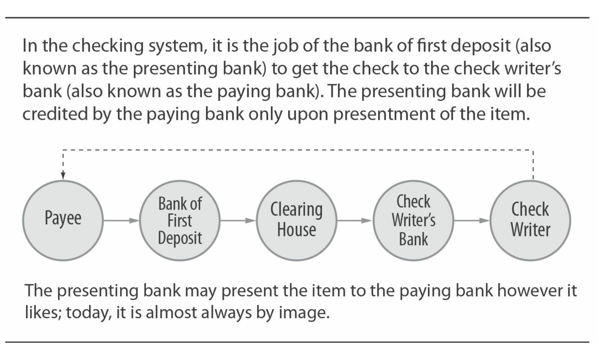
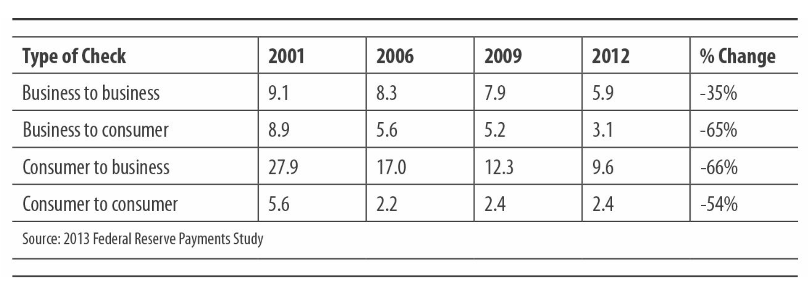
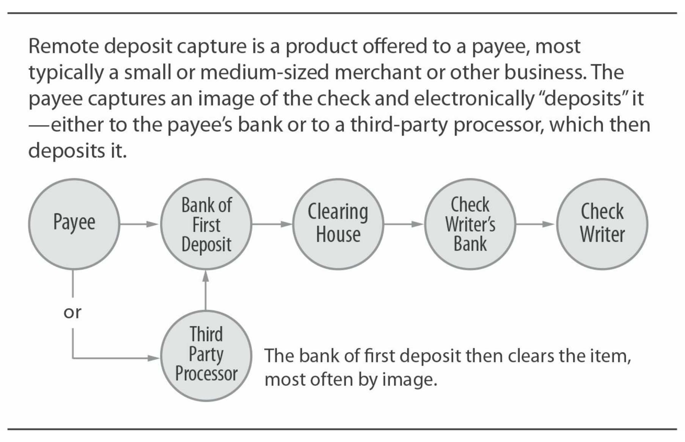

# 核心系统：支票

* 类型：拉模式
* 所有权：没有单一拥有者，支票清算所是银行或私有处理商拥有
* 监管：美国法律，支付网络规则，美联储银行规章
* 支付网络经济：按面值清算
* 处理流程：银行类用图像识别或纸质清算；批处理
* 风险管理：中间商和终端用户管理

&nbsp;
## 历史背景

美国的支票系统是我们最古老的系统，也是我们使用最广泛的开放支付系统之一。我们今天所知道的支票系统的起源可以追溯到中世纪，也许是更早的时期。许多经济体开发了某种版本的文件，允许将资金从一家银行转移到另一家银行。该词本身来自阿拉伯语şakk。有许多相关的支付订单文件，包括汇票，票据，汇票和信用证，以及专门的支票形式，例如柜台支票，合格支票和银行支票。

支票被视为可转让票据。它指示银行从存款金融机构的支票帐户中支出资金，并将这些资金提供给支票上指定的人或机构。作为可转让票据，支票可以从一个人转移到另一个人。在美国，支票是由银行和其他具有监管权限的银行和其他金融机构提供的服务，用于操作活期存款帐户（DDA），即我们所称的支票帐户的正式名称。

如今，美国支票系统是一种高度自动化的手段，可将资金从一个终端用户转移到另一方。尽管支票交易是从一张纸开始的，但当今几乎所有的支票处理都是电子的。这种电子处理与非常高的交易量相结合，使单位成本相对较低。

向其银行出示或存入支票的客户对银行造成了问题。 支票是对一个帐户（通常在另一家银行）的索偿。 消费者的银行如何从另一家银行收取资金？ 从历史上看，这一过程称为双边结算。 存款银行将向另一家银行发送信使； 信使会出示支票并收取资金（可能是黄金，现金或钞票）作为回报。

从美国早期开始，检查系统的发展可以分为三个重要阶段，所有这些阶段均以清算和结算方法的进步为标志。

&nbsp;

## 第一阶段：清算所的发展

在美国的18世纪和19世纪，银行的数量以及开出的支票的数量在增长，这使得双边清算和结算的过程变得越来越繁琐。邮差携带了几袋支票，要交给其他银行；从交换所收到的现金或其他物品也可能会被盗。

1853年，第一家支票结算所在纽约市成立。银行加入了支票清算所，并在每个银行工作日将存入其他成员银行的支票汇入银行。支票清算所促进了银行之间有序的支票交换，并且重要的是，计算了每家银行的每日净结算额。然后，银行为他们的结算帐户提供资金或从中提取资金。很快，在其他主要城市也建立了类似的支票清算所，以及在城市间，区域和国家间的支票清算所。

成立于20世纪初的联邦储备银行系统发挥了重要作用，要求其全国各地的成员银行接受面值的存款支票。这意味着存款银行将向其客户贷记“ 1美元兑1美元”，而不是较低的百分比。美联储的要求，加上全国各地支票清算所的发展，使支票变成了真正的国民支付系统。

&nbsp;

## 第二阶段：自动化 — MICR和分选器

在1950年代末和1960年代初，引入并广泛使用借助MICR（磁性墨水字符识别）字符，可以进行高速检查处理。 MICR字符（用于识别支票所在的银行和帐户）出现在支票的底部。 支票金额是在支票生成后添加的，通常由第一笔存款的银行在称为编码的过程中添加。 双方的银行以及清算中心和处理商都使用支票分类器，来读取的MICR行，并将单个支票放入箱中。 当每张支票流经分拣器时，它们通常还会捕获每张支票两面的图像。

其他发展进一步促进了全国范围的自动支票处理。 存管金融机构使用统一的银行编号方案（美国银行业协会分配的转接路线编号）是一个重要因素。 禁止州际银行业务的法律逐渐解散，导致许多大型的国家和地区银行专注于“on-us”的更广泛定义：许多银行首次发现自己是多个票据交换所的成员。 大规模航空运输服务的出现减少了对代理行的处理链的麻烦。 为小型银行服务的处理商开发了“on-we”支票清算功能，在某种程度上模仿了国家银行的多状态支票处理能力。

### 假如？

如果支票系统朝另一个方向发展，而是采用折扣（而非面值）清算和结算模型，则该系统看起来很像我们基于交换的卡支付系统。收到100美元支票的商户可以将支票存入其银行，这会将其帐户中的98美元记入贷方。然后，银行将把支票交给消费者的银行，并收到$ 98的信用额。消费者的银行会从其客户的帐户中扣除$ 100，其余的$ 2作为交易利润。

一些行业观察家建议，美联储对借记卡交易施加类似的“面值”模型，类似于支票，除了“良好资金”和卡提供的欺诈担保。美联储没有被劝说这样做，导致加大了游说力度，以确保按照这些方针进行立法。作为《多德-弗兰克法案》一部分的《杜宾修正案》的通过
国会在2008年通过的法案可能受到了这些努力的影响。

&nbsp;

## 第三阶段：图像化

尽管MICR和支票分类设备可以自动进行支票交换，但是银行仍然必须管理和存储纸质支票。这对银行造成了特别的负担，必须保留每张实物支票，并经常将其与月结单一起退还给开票行。链中的其他人员，包括存款银行，中介银行和加工商，可能需要查看纸质支票才能解决纠纷或查询，从而导致繁琐而昂贵的工作。当成像技术在1980年代末期和1990年代末开始成熟时，银行发现了降低内部使用成本的机会，对于存储支票和取回支票以供查询。银行开始在他们的支票分类机上添加摄像头，以捕获每张通过机器的文件的图像。

银行花费了十多年的时间来投资和学习使用图像技术，主要用于存档目的。使用图像进行清除（交换图像而不是纸张）是一种逻辑扩展。在此期间，银行家通过不同的小组一起工作，以探索“电子支票”和“支票截断”。一些大型银行确实交换了图像。其他人则使用私有的多方协议交换了MICR线路数据文件以进行发布，并随后进行了物理检查。无论哪种情况，基本法律仍然要求使用原始纸质支票向支票开立人的银行出具汇票。这极大地阻碍了通过图像进行清除的工作，因为如果发生纠纷，查询或错误，沿线的任何地方的银行都可能需要使用原始的纸质支票。

2004年10月生效的《 21世纪支票清算法案》（Check 21）解决了这个问题。 Check 21是由联邦储备银行提出并赞助的，他希望该行业转向电子结算，但不希望强制这样做。

### 禁飞的飞机

2001年9月11日的事件经常被认为是美联储采取行动支持Check 21法的原因。在袭击发生后的几天里，当飞机没有飞行并且支票没有移动时，美联储（在技术上充当支票处理的代理行，出示给美联储的支票被存入出示行在美联储的的账户）的浮存达到了警戒的水平，因为美联储（Fed）无法向支付行出示支票。实际上，美联储在一段时间内一直在积极致力于推动Check 21类型的法律：9/11推动了这一法律的向前发展。

Check 21法律没有强制要求清除图像，而是仅声明原始支票的打印副本（“替代支票”或“图像替换文件” -IRD）在法律上等同于原始纸质支票。

银行可能仍拒绝接受图像，但必须接受图像的打印副本。实际上，这意味着实际上与支票发行人的银行相距甚远的存款银行可以将图像（通常通过票据交换所）发送到支票发行人的银行附近的打印机；纸质打印可以代表存款银行。

在当今的美国，支票支付系统几乎完全是电子的，因为事实证明，图像化是提高支票收集速度，降低风险并降低运营成本的重要进步。

&nbsp;

## 角色与价值链

支票支付系统最基本的涉及三个方面：支票书写者，支票接收人以及存入支票的银行。 如果（最典型的情况）支票写信人和收款人使用不同的银行，则有四个参与方。 支票价值链如下图所示：

### 支票：我们最新的电子支付系统

Check 21的结果令人瞩目。大多数银行从2007年开始认真执行支票图像清算。到2010年初，美联储宣布99％的通过美联储进行的支票清算均以电子方式进行处理。

支票发行人的银行向其客户（无论是消费者，企业，非营利组织还是政府实体）提供以支票为特征的活期存款帐户。支票书写者的银行向客户提供空白的支票，或为客户提供带详细信息（运输路线编号和帐号）的支票。

支票书写者书写支票，指定支票的收款人，日期和美元金额。书写可以是与消费者一样的手动操作，也可以是与大型公司一样通过自动打印过程完成的操作。

然后，支票编写者将支票发送给收件人。收款人将支票存入收款人具有活期存款帐户的银行。 （或者，收款人可以将支票背书，然后交给非银行中介机构，由该中介机构承担支票的收款人的角色。）

存款银行将其帐户记入贷方，并根据其资金可用政策将其存款提供给客户使用（例如提取现金）。 存款银行的存量政策受到美联储CC法规的约束，该法规规定了各种支票的最低存量。 但是，许多银行提供的可用条款比法规要求的要宽松得多。 这是银行之间竞争的根源，特别是对于小型企业的支票账户。

当接收方的银行或存款银行必须决定如何清除支票时，即如何将支票送到支票发行人的银行时，支票支付系统的复杂性就会在链中的这一点上显露出来。

存款银行不受任何法律或法规约束以任何特定方式清算支票-可以通过结算所，通过与该银行的双边结算，通过将清算支票存入代理银行（然后称为“第二笔存款的银行”），或将支票交给处理商，它决定清算方法。

&nbsp;

## 图像化前的清算环境

### 存款行

从历史上看，存款银行会通过评估诸如支票的美元价值，存款时间，到付款银行的距离以及商业航班时间表等问题来做出这些决定。 这些因素之所以重要，是因为付款银行的义务是在实际出示支票时发生。 存款银行必须评估在更快地获得资金（通过快速交付支票）和管理交付成本（通过使用低成本的交付机制）之间的权衡。 将存款银行的展示决策策略输入到支票分类器中，然后该支票分类器将支票项目放入可通过各种方法进行清算的箱中，并发送到各种付款银行。

### 支票系统的巨大价值？

支票的一个鲜为人知的功能是支票编写者不需要知道，传输或存储有关收款人的银行或银行帐号的任何信息的事实。 可以将其视为内置的PCI-DSS兼容性！ 当然，支票编写者正在发送自己的帐户数据（在支票上可见），这会产生另一种潜在的欺诈风险。

### 清算中心

图像化前环境中的大多数支票都是通过清算中心进行的。 清算中心从存款银行收到支票，并附上现金信，基本上是一张存单，显示要出多少张支票以及价值多少。 最典型的是，带到清算中心的支票已经预先装好了，按照每个付款银行分成的袋装或捆装。 交换了支票，然后清算中心为参与清算所的银行计算了净清算总额。 清算中心可以自行执行该结算过程，也可以将其外包给联邦储备银行（运行结算服务）或其他结算提供商。

### 清除复杂性

U.C.C. 4：“收款银行应在考虑相关指示，该物品的性质，这些物品的数量，所涉及的收款成本以及该收款人或其他人通常使用的方法后，以合理迅速的方式发送物品。展示这些项目。”

### 支付银行

支付银行从清算中心接收支票，然后再次将其通过分拣器运行，从而创建交易明细文件，该文件用于将交易过帐到支票编写者的帐户。从历史上看，这些过帐是在银行每晚对DDA系统进行批处理时完成的。如果在运行之后某个帐户没有足够的资金来支付过帐到该帐户的支票，则付款银行可以保留该交易并向客户提供透支贷款，或者拒绝该交易并将其“退回”给存款银行。当然，该决定通常是自动化的，取决于银行DDA系统中编程的政策。如果银行保留支票并维持透支，则透支将成为受制于该机构贷款政策的贷款。

### 会合

在几十年前的一些城市中，“支票清算所”不过是一个地方，甚至是停车场，银行同意会面以交换支票袋！

### 盲投

支票和ACH借记（类似支票）交易均以“盲目的”基础过账到客户的帐户中。 意思是说，消费者的银行在过帐之前不会检查帐户中是否有足够的资金。 没有与信用卡或借记卡相同的授权流程。

&nbsp;

## 图像化清算

### 存款银行

在图像化处理环境中，存款银行通常将对由另一家银行支付的所有支票成像。 “捕获”支票图像的位置因银行而异。 高度自动化的银行会在存款点捕获(ATM机或分行出纳员的窗口中)。 其他银行则在后台处理中心捕获存款，或将纸质物品交付给处理它们的处理商。 然后，银行（或其处理商）通过某种形式的清算中心或通过转换为ACH，确定是否以与付款银行的某种双边安排形式提供给定项目。 如果转换为ACH，则物料必须符合该交易类型的NACHA规则。

接下来发生的事情在很大程度上取决于相关的存款银行。 根据需要发生的功能来思考更容易，而不是由执行这些功能的实体。 存款银行必须：

  * 直接或通过服务商或处理商将图像传送到付款银行
  * 确保已打印出IRD（图像替换文件）并将其交付给不想接收图像的付款银行
  * 与付款银行结算

处理商或清算中心可以处理所有或部分这些任务。

### 图像清算 — 未来

行业内正在讨论许多场景，在某些情况下甚至在实践中。 一种可能的方式是，将来自ATM的支票图像（用于存款）立即动态呈现给付款银行。 如果付款银行采用实时过帐（而不是在夜间批量运行期间等待过帐），则存款银行将立即知道支票是否拒付。 另一种可能性是图像本身不直接呈现给付款银行，而是保存在任何一家银行均可访问的档案中。 在这种情况下，存款银行将简单地将MICR信息以及存档地址发送到付款银行，而付款银行将从该文件中过帐该项目。

&nbsp;

## 所有权和监管法规

### 所有权

没有哪个实体拥有支票支付系统。 每个银行选择如何支持支票的方式，既包括活期存款帐户上写的支票，也包括存入其帐户上的支票。 银行通常属于一个或多个清算中心，传统上是非营利性的银行所有的合作社。 如今，一些清算中心继续由银行拥有，而其他清算中心则由营利性公司拥有。 向银行提供支票处理的大型处理商在某些功能上类似于清算所。

### 图像化清算的图像

将银行支票支付的内部处理从纸张转移到电子，使本已非常高效的支付系统变得更加高效。 清除物品所需的时间已大大缩短，现在，有时比ACH或卡片的清除速度更快。 也许最重要的是，全国各地运输支票的成本已基本消除。 现在可以将支票视为一种预先支付的纸质订单-一种一次性付款卡。

### 监管法规

支票的监管框架是美国法律，尤其是《统一商法典》。 U.C.C.第3条和第4条指定有关银行存款和收款的规定，以及支票交易中各方的责任。当U.C.C.该法案于1950年代初出版，并被50个州中的每个州采用，它有助于为一般的商业交易（特别是支票）创建统一的法律框架，并降低了该系统的某些法律复杂性。 2004年的Check 21法令是影响支票系统的下一个美国主要法律。如前所述，支票21将替代支票（称为图像替换文件的原始支票的图像的打印副本）作为原始支票的合法等同物。

美联储作为监管机构，发布实施支票系统的法规。美联储的主要支票法规包括规章J和CC，它们共同规定了有关支票可用性和支票清算其他方面的规定。如果存款银行使用美联储的付款服务来结算支票，则必须遵守美联储的3号操作通告。

支票结算所具有绑定参与银行的系统规则，管理展示时间，批处理和现金信约定以及其他操作问题。清算中心的规则和卡式支付和ACH支付中的支付系统规则不尽相同-它们不涵盖银行向其客户提供的支票产品的要求。支票和图像处理公司的操作规则在范围上也相似。

ECCHO（电子支票结算所组织）是一家非营利性银行合作社（从技术上讲，是一个互惠互利的结算所），它已制定了图像交换规则。双边交换图像的银行或图像清算中心可以选择遵守这些规则；但是，这些规则仅适用于ECCHO成员之间交换的项目。

## 支票使用，数量和趋势

由于支票付款系统是如此之大且分散，因此很难确定确切的数量。 美联储定期委托选定银行检查支票数量； 这些用于推算国家级体量。 一些这样的调查着眼于单个项目，以确定对谁是付款人，谁是收款人以及支票的目的的估计。

支票数量非常大，但在某些细分市场中正在迅速下降。 近期美联储付款研究的数据显示，总体急剧下降，但在某些领域尤其是急剧下降，例如销售点（POS）付款和票据付款，如下表所示。

某些支票不会作为支票支付，而是转换为ACH（请参见[第4章](ch4.md)）。

### 过渡中的支票法规

重要的是要注意，随着从纸质支票到图像支票的过渡，适用于纸质支票的法律和法规默认情况下不适用于支票图像交换。 发生争议时，这会给所有各方带来不确定性的风险。 各方之间的图像交换协议是解决这种风险的手段。

&nbsp;

## 支票经济学

美国支票系统的经济性可通过首先查看销售给终端用户的基于支票的产品，然后查看支持这些产品的基础处理和清算基础结构。 尤其是银行，用许多不同的支票产品的收益来抵消支票处理平台的成本。 随着支票的绝对数量下降，更重要的是，支票清算方式从纸张变为电子，处理成本正以令人眼花缭乱的速度变化。

&nbsp;

## 支票系统产品

### 支票帐户 - 消费者和小型企业

银行为消费者和小型企业提供支票书写和存款功能，作为捆绑的“支票账户”产品的一部分。写或存入 个人支票 很少单独定价。银行尤其将支票书写视为将存款带入银行的一揽子计划的重要组成部分。对于资金不足而开立的支票，当银行选择不退还时，银行会收取NSF（资金不足）费用；从历史上看，这一直是银行收入的重要来源。小型企业支票帐户的工作方式相同（实际上，通常共享相同的交付平台），但是通常会限制给定月份内可以开立的支票数量，如果超过该数量，则收取交易费用。对于消费者和小型企业而言，银行都将支票视为帐户套餐中的必要组成部分，该套餐可从帐户余额，借记卡手续费和费用中获得的利息收入的价值中获取收入。

### 支票帐户—大型企业

大型企业为工资单，福利和供应商付款开出支票。 银行为这些企业提供带有交易费用明细表的支票账户。 企业可以使用其帐户中“补偿余额”的值来完全或部分抵消费用（称为“帐户分析”）。 专用支票帐户称为受控支出帐户，用于帮助企业了解和控制针对该帐户显示的支票支票的时间安排。 对于希望优化其现金使用量的公司而言，此信息和控制非常重要，从而可以做出更好的借贷和投资决策。 积极的薪酬欺诈控制（只有支票与企业提供给银行的文件中的支票号和金额匹配，才由银行支付支票）和自动帐户对账是这些帐户的典型支持服务。

### 密码箱服务 — 企业

银行和非银行都提供特殊产品，以服务于接受来自消费者或其他企业的支票的企业。

零售密码箱服务 旨在处理来自消费者（例如公用事业公司或保险公司）的大量支票。零售密码箱提供商控制着将消费者支票定向到的邮政信箱。提供商每天几次从邮局取回信封，打开信封，对支票进行编码，将其发送到清算处，扫描汇款通知书（消费者将其与支票一起放入信封中），并创建付款文件，企业客户用其更新帐单文件。这是一个高度自动化的且历史上利润较低的业务。对企业客户的价值是加速资金收集和自动数据采集。定价基于每次交易，并收取数据费等。

批发密码箱服务与此类似，但重点是从商业客户那里收到的高价值支票。汇入的汇款通知书各有不同（格式由付款客户的支票打印系统确定），从中获取数据的过程自动化程度较低，而且成本较高。传统上，批发密码箱的价值在很大程度上取决于快速清算高价值支票的能力-自动数据捕获是次要的。

图像清除和远程存款支票捕获正在极大地改变这项业务的动力。现在，许多批发密码箱提供商都处理入站ACH付款和入站支票，从而创建有关银行存款和汇款数据馈送的单点信息。定价是基于交易的，通常是按击键输入的，并对数据收取额外费用。

### 远程存款捕获

银行向各种规模的消费者和企业提供远程存款捕获（RDC）产品。 随着包括用于捕获支票图像的摄像头在内的移动智能手机技术的出现，RDC的普及率急剧上升，因为它有助于避免前往本地ATM或银行支行进行存款！

如下所示，这项服务允许收款人扫描并电子存入所收到的支票。

RDC提供者承担企业扫描了有效纸质支票的风险。 如果提供者是非银行，则图像将存储在银行中。 无论哪种情况，银行都可以将其作为图像提交清算，或者选择将其转换为替代支票并作为纸质进行清算。 对企业来说，价值是通过不实际存放支票而节省的时间和成本。 提供者在服务支持的扫描设备方面变得越来越灵活。 远程存款捕获通常按固定的单笔交易定价，或者可以简单地捆绑到该帐户的总成本中。

### 零售商家支票存款服务

从历史上看，大型零售商收到大量支票来支付购买费用。与开票人不同，商家必须在付款时做出接受决定。许多零售商基于在ECR（电子收银机）或具有支票读取功能的终端上读取MICR线，使用自动化系统来决定是否接受支票。决策系统可以简单地使用零售商内部系统中的数据（例如，已知的不良支票书写者的文件），也可以访问外部数据库。零售商可以选择通过提供这些选项的服务提供商来验证支票（确定帐户是否真实且信誉良好），甚至可以保证。

大多数大型零售商系统将支票编码为已收到的支票（放入美元MICR行上的金额）以避免这样做的银行费用。零售商向接受交易的银行或非银行方支付每次交易的存款费。如果零售商使用的是支票担保服务，则提供商会收取固定费用加上价值费用的一定百分比；这使交易的经济性类似于信用卡的。

零售商家需要确定收到的支票是否将转换为ACH，如果是，则将其以收银机（POP或购买点格式）或后台部门（BOC或后台转换格式）进行转换。 ），转换为图像（远程存款捕获）或以纸张形式保存。 如果转换为ACH，则NACHA规则对可以转换哪种支票类型设置了限制。 一些零售商在内部进行此操作。 其他人将支票交给服务提供商，后者代表他们做出决策，处理和保存交易。

随着借记卡的普及，许多零售商家已决定完全停止接受支票。 当然，对支票接受的限制有助于进一步促进消费者使用借记卡。

### 其他支票产品 — 消费者

消费者从银行或第三方支票打印机（也向银行提供支票库存的公司）购买（或得到）空白支票簿。

没有银行账户的消费者使用非银行账户提供的支票等价物。 支票兑现服务允许消费者通过认可支票兑现服务来兑现支票。 汇票由商店，邮局和其他零售服务提供商出售。

还有许多特殊的消费者支票产品，包括旅行支票，认证支票，出纳支票和银行支票。

### 其他检查产品 — 企业

许多小型企业使用会计软件包（例如QuickBooks）来写支票。 软件公司和其他提供商会提供支票库存以使用这些软件包。

一些大型企业使用支票打印机在内部打印支票，该支票打印机从企业的应付帐款和/或薪资系统接收其数据流。 其他人将检查打印服务的过程外包。 这在工资核算应用程序中尤为常见，该服务管理工资核算的多个方面（税金计算，退休金等）。 此类服务还管理企业的ACH工资支付。

&nbsp;

## 支票清算和基础设施经济学

银行，票据交换所和处理商都参与支票清算的经济价值链。银行通常有单独的操作区域来处理支票存款处理和“内部清算”，即接收提交给银行以进行付款的支票的过程。这两个区域中的一个或两个都可以外包给处理商。

银行或处理商有操作费用与接受或交付纸质支票有关；操作支票分类机；成像和存档支票；运行和维护将银行策略应用于各个项目的应用程序，以确定支票过帐时间，资金可用性和透支；和管理结算帐户的对帐。清算中心有确定结算总额和管理结算过程相关的费用。

处理商和清算中心向使用其服务的银行收取交易费。许多银行都向较小的银行提供代理服务：较大的银行可以充当处理商并处理支票，收取交易费，但具有帐户分析因子（为了存在银行的余额给予较小的银行信贷）。

### 捆绑支票和卡接受

许多收卡行及其ISO将检查接受与卡片接受捆绑在一起，特别是对于中小型企业。就像收卡行会为零售商处理卡付款，然后将收益存入该零售商指定的银行帐户一样，它也会处理支票（通常通过远程存款捕获和/或ACH转换）。

一般而言，银行和处理商对于支票退回和异常项目相关的收费相当高； 这些费用可能大大超过“普通”物品的费用。 银行使用“第2天处理”一词来表示付款银行接受或拒绝某项目后所产生的所有活动（退货，调整，报表制作，研究等）。

对于各方而言，支票经济学的最后一个重要要素是欺诈和欺诈（及其他风险）管理的成本。

&nbsp;

## 风险管理

支票欺诈的历史悠久而又丰富多彩。它分为许多类别，包括伪造的支票。在合法支票上伪造签名；更改的金额，日期或收款人；欺诈性背书；以及计划欺诈，例如支票工具。从技术上讲，在账户中写上资金不足的支票（称为NSF）虽然从技术上讲是欺诈行为，但通常被视为一种单独的风险敞口类别，因为支票书写者可能会或可能不会意识到资金不足的情况。

### 资金不足（NSF）风险

接受支票的收款人面临支票“拒付”的风险。如果支票发行人的银行因资金不足而支票支付，则从消费者那里收取款项的风险就会转移到银行（从NSF费用中获得的收入也将转移到消费者身上！）。退还已退回的支票时，存托银行将从其客户的帐户中扣除；如果该客户此后从帐户中提取了资金，则该银行将面临风险。收款人（或其银行）可以以纸质，图像形式或通过ACH交易形式出示退回的付款支票。如上所述，收款人，尤其是零售商，可以使用内部或外部数据库或服务来帮助管理此风险。收款人还可以选择购买支票验证或担保服务。

零售商人，开票人和企业最容易遭受NSF风险。尽管尚无确切数字，但业界估计的年度损失在100亿美元左右。 NSF的银行损失没有披露，但损失要小得多。总体而言，鉴于从消费者那里收取的非常有利可图的NSF手续费收入，银行认为这些损失是可以接受的。

### 支票欺诈

如果在有效的帐户上伪造了支票，或者更改了有效的支票，而收款人接受了该支票并将其存入银行，那么有人将因欺诈而蒙受损失。支票开立银行有法定义务在“应付款”时​​付款。支票书写者与其他各方一样，有责任行使“常规照料”。 U.C.C.中的规定大量的判例法导致重大损失，这是由于法院或仲裁将欺诈行为分配给了交易的各方。确定暴露是复杂的，特别是考虑到向成像的过渡以及随后的监管并发症。实际上，与支票书写公司一样，商人（和开票人）最终也面临很多风险。据信，由于支票被退回造成的商户损失要比其他类型的支票欺诈造成的损失高得多。在美国，通常认为银行每年因支票欺诈所造成的损失少于10亿美元。

伪造的支票（包括伪造的出纳支票）从不存在的帐户中提取。此类支票由存款银行负责，然后由存款银行尝试从存款客户的帐户中提取资金。

### 什么是浮盈？ （第2部分，共2部分）

浮盈是支票系统经济学中不可或缺的一部分，也是业务中最容易被误解的术语之一！ 部分原因是该术语以多种方式使用。 概括而言，浮盈是指两方之间转移资金的可用性方面的差距。

有时这是很具体的：“联邦储备浮动”是指作为支票清算行的美联储在从付款银行收取款项之前，将存入资金存入存款银行。 （从历史上看，美联储已经这样做，代表代办银行管理支票收支中的不确定性。）

浮动通常更像是一种感知问题：“付款浮动汇率”是一个术语，用于描述公司邮寄支票（大概是将其义务卖给卖方）与支票实际出示给银行的时间之间的差距。

浮动汇率通常是用相对的术语讨论的：如果银行在收款后平均1.5天内收集存入的支票，并且将其减少到平均1.25天，则浮动率得到了改善。 如果银行在收到有关支票的付款之前向存款客户提供了充足的资金，则将产生浮动费用-如果相关客户将余额留在帐户中，这可能是理论上的费用，而不是实际费用。

困惑？ 关于浮动的一件事要记住。 图像清除以及相关产品和概念（ACH支票转换，远程存款捕获）正在极大地减少美国支票系统中浮动的数量和重要性。

### 技术与检查欺诈

当今的高分辨率扫描仪和打印机使在合法帐户上伪造支票变得更加容易。同样，在网上银行会议期间查看已付支票图像的能力也引起银行家的焦虑，因为伪造的凭证可能使欺诈者看到支票的“完美图像”，从而为伪造提供了模板。尽管存在这些问题，银行显然仍然能够控制支票伪造的总体水平。

&nbsp;

## 风险管理产品

为了帮助最大程度地减少欺诈行为，零售商购买了支票验证和担保产品（如上所述），以及访问外部数据库。银行购买类似的产品，以指导接受存款和兑现支票的决定；银行业在由预警服务管理的数据库上进行协作，该数据库提供了这些数据。银行处理器提供的软件可通过检查帐户内和帐户间的交易模式来帮助识别欺诈性交易。 （使用类似的软件来检测违反洗钱法规的交易。）银行和零售商使用广泛的产品和服务来检测伪造的支票，识别欺诈性签名等。

&nbsp;

## 主要供应商

### 美联储银行

美联储委员会和美联储银行（统称为“美联储”）在支票行业中具有独特的地位。 “美联储”扮演三个角色：

  * 作为支付行业的监管者，它编写了规则来管理跨多个支付系统的银行和其他方的行为。
  * 作为支付服务的提供者，它运营着该国最大的支票和支票图像交换所。 （它还操作两个ACH交换机之一和两个电汇系统之一（Fedwire），并且是向银行提供现金和货币的唯一提供商。）美联储仅向银行出售这些服务。
  * 作为国家结算服务的经理，它为多个私营部门的清算中心（包括纸质和电子结算所）提供结算服务。

### 美联储行动

美联储采取了两项平行行动，以鼓励该行业转向图像清除。它赞助并拥护最终通过“ Check 21”的法律。但它也宣布了一系列决定，以关闭全国各地银行使用的本地支票处理（清算中心）设施。这意味着银行必须以更大的成本向更远的地方发送纸质支票，这使它们更加渴望实施图像清除。

### 清算中心

清算中心是一家银行所有的支付公司，在银行业中是安静的力量。它最初成立于1853年，是纽约清算中心（用于支票清算），它与其他清算中心和支付公司进行了一系列合并，并通过建立新的支付服务来为其成员银行提供服务而发展壮大。如今，它已由二十四家大型银行（美国银行和国际银行在美国的分支机构）拥有。它是美联储向银行提供支付服务的主要竞争对手，这些服务包括提供支票和图像清算，ACH处理（该国是该国的另一家ACH运营商），以及通过CHIPS进行电汇处理。

### 摘要：支票

长期以来，支票在美国占主导地位的非现金支付系统正在下降。但是，支票清算实践的根本变化已经改变了系统的经济性。

### 支票的主要趋势

  * 支票的数量仍然很大，但总体上下降了，在POS和帐单支付领域尤为明显。
  * 图像清算和支票到ACH的转换已大大改变了银行的清算习惯和处理支票的单位成本。
  * 自动柜员机，分支机构和终端用户进行的远程图像捕获降低了支票接受的成本，并降低了浮动和风险。 
  * 工作组正在研究“全电子支票”（一个可能的术语-EPO或电子付款单），一种以支票图像开头的工具。

### 信息来源 - 支票
  * PaymentsNews.com
  * ECCHO
  * 清算中心
  * 美联储零售付款办公室个人美联储
  * 金融服务技术联盟
  * 银行行政学院（BAI）