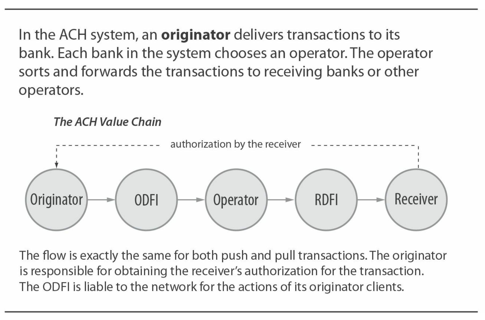
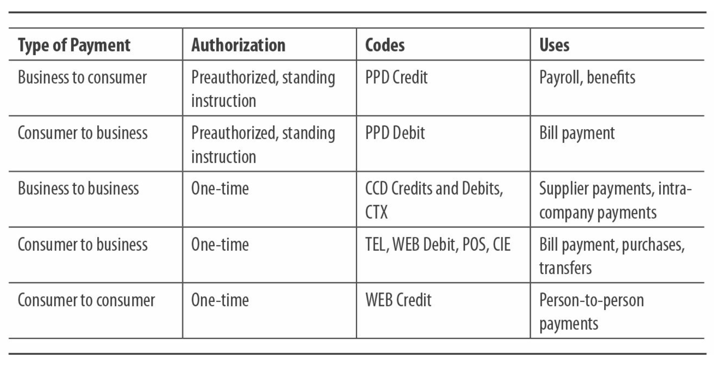
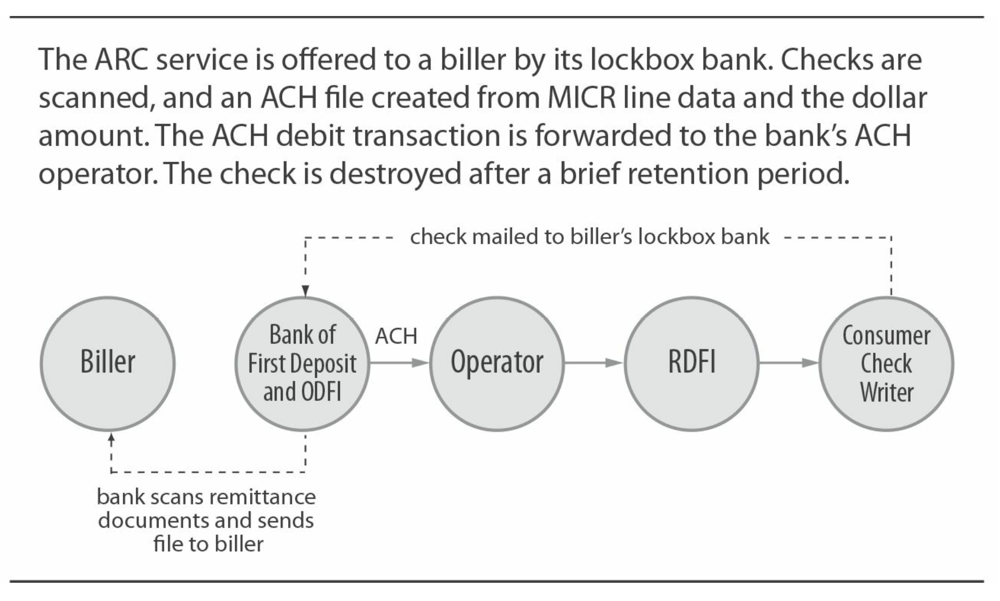
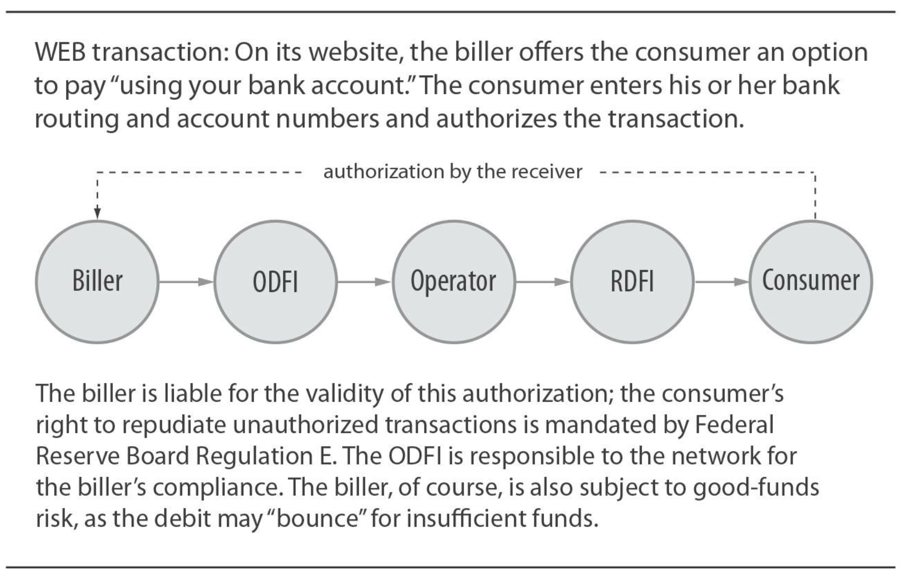

# 核心系统：ACH

* 类型：拉和推模式
* 所有权：银行所有
* 监管：NACHA规则，美联储银行规章
* 支付网络经济：按面值清算except for “same day”
* 处理流程：电子化；批处理
* 风险管理：中间商和终端用户管理

## 历史背景

ACH或自动清算所是美国最大的支付网络之一。它是银行拥有的工具，用于许多不同类型的消费者和企业应用程序。非营利性协会NACHA（以前叫国家自动票据交换所协会，但现在是NACHA：电子支付协会）是ACH网络的受托人，管理规章和规则制定流程，然后定义NACHA操作规则。

ACH系统由从事支票处理自动化工作的银行家于1970年代启动。随着支票阅读器/分类器的引入，很明显，将交易过帐到客户帐户所需的全部就是MICR数据。这些银行家问道：“为什么不直接交换MICR数据，而不是交换支票然后提取MICR数据？”请注意，这不是支票裁切或支票图像清算的早期尝试，而是专注于让电子交易完全取代纸质交易。

_注意：要真正了解ACH系统，请先阅读[第3章](ch3.md)，检查。 ACH是由许多在银行进行支票业务的人创建的。_

在ACH初期，银行家将重点放在高容量，低风险，重复性交易-特别是薪资支票，社会保障福利支票和保险费支付。

结果是，ACH比美国其他任何支付网络都更能连接到该国的每个活期存款帐户（支票账户）。 希望使用ACH交易类型之一进行付款或收款的企业可以这样做，并能安全地计划，接触到该国的每个银行消费者和企业。 此外，持有通用可再充值（GPR）预付卡（请参阅第5章）的消费者可以通过ACH将资金存入这些卡帐户中。

### 破解鸡和鸡蛋问题

刚刚起步的ACH网络成立于1970年代中期。它旨在降低参与银行的成本。在美国大部分地区，当地的ACH协会是由参加每个地区的支票清算所的银行家组成的。但是参与仍然是可选的，而且在早期，该网络也面临着所有新的支付网络所面临的“鸡与蛋”问题。对于ACH，问题是：“如果大多数银行不参与，我们如何让消费者注册ACH（例如，直接存入薪水支票）？如果我们没有消费者要求以这种方式付款，我们如何让银行参与？”在这种情况下，答案是政府。美国政府提出通过ACH支付社会保障福利。它实际上询问银行：“您有任何获得社会保障福利的客户吗？”当然，答案是肯定的。在15年的时间里，几乎所有“储蓄金融机构”，包括储蓄机构，储蓄和贷款以及信用合作社，都加入了ACH网络。

&nbsp;
## 角色与价值链

作为本节的背景，重要的是要了解ACH是美国唯一处理推式和拉式交易的支付系统：

  * 资金的付款人发起“推”交易（称为ACH贷方），并将钱发送给接收方。
  * 资金的接收方发起“拉”交易（称为ACH借方），并从付款方中提取钱款。

如下所示，“推”付款和“拉”付款的基本角色和核心价值链是相同的，尽管正如我们将看到的，每种类型的风险和经济性都大不相同。

发起人（通常是企业）将ACH交易输入ACH付款系统。 发起人将交易托付给其银行，称为ODFI(发起存托金融机构)。 ODFI会将其客户帐户记入贷方或借方帐户（取决于交易是“拉”还是“推”），然后将交易转发给其选择的ACH运营商。 运营商执行转换角色，将交易传递到RDFI（接收存管金融机构）。 （如果ODFI和RDFI使用不同的ACH操作员-美国只有两个操作员，则第一个操作员将交易切换到第二个操作员。）然后，RDFI借记或贷记其客户（接收者）的帐户，这再次取决于交易是“拉”还是“推”。

&nbsp;
## ACH结算

如今，ACH运营商每天都在计算其银行的净结算总额。 这些总额将提交给美联储，美联储使用其国家结算服务机构管理实际的结算过程。 实际上，这会导致银行及其客户之间的“零浮动”，尽管有些银行可能会管理客户账户的借方或贷方时间，以适应风险政策。

### ACH“直接发送”

与支票一样，两个银行（或一组银行）可以双边交换交易，而不必使用ACH运营商。 尽管确实发生了这种情况，但运营商的极低成本和效率使银行不愿这样做。

&nbsp;
## 所有权和法规

实际上，ACH由其所属的银行（存款金融机构）拥有。 NACHA是监督网络的非营利协会。存款性金融机构（在此称为“银行”）直接或通过地方或地区支付协会隶属于NACHA。 NACHA章程规定了如何在银行和支付协会成员之间分配投票权。

### NACHA的角色

NACHA的主要角色是制定规则，下面将进行讨论。与卡网络不同，NACHA不参与处理。中间银行之间的交易切换由ACH运营商完成。 （目前有两家运营商-票据交换所拥有的联邦储备银行和电子支付网络（EPN）。）

### 有品牌问题吗？

观察品牌问题如何在电子商务领域发挥作用将很有趣。今天，我们在结帐页面上看到第三方品牌和信用卡品牌一起出现，但是，如果商家接受ACH“电子支票”，则它们很容易加上诸如“用您的银行帐户付款”之类的描述。

NACHA积极参与其成员机构及其企业客户，以开发和测试产品增强功能和新产品。 但是，它的运行规模与卡网络不同。 它的预算比卡网络低得多，因此在开发通过会员银行分发的新产品方面受到限制。

NACHA在品牌创建或传播中不起作用。 这样，它更类似于支票清算中心而不是卡网络。 尽管一些“小b”品牌已经发展起来（“工资直接存入”，有争议的“电子支票”），但是没有与ACH等效的接受标记，例如“ Visa”或“ NYCE”。 尽管缺乏品牌建设，但该系统仍显示出强劲的增长势头，它为银行及其客户提供了一套有效的“轨道”，供其使用。

### 为什么ACH与众不同

当ACH网络如此普遍时，为什么NACHA的角色如此有限？ 答案-当然是钱。 使用ACH网络的银行无需向NACHA缴纳“税”（与卡网络评估相比）。 结果，NACHA没有像卡网络那样具有用于产品开发，品牌广告或网络扩展的资源。 当然，有人可能会争辩说，卡网络之所以能够收取这种“税”，是因为银行通过发行卡产品获得的直接收入（利息，互换费，手续费）。

### ACH法规

ACH交易受NACHA私人规则和联邦储备银行法规的约束。

NACHA规则绑定ODFI，RDFI和ACH运营商。发起者，接收者和第三方服务提供商受与其ODFI和/或RDFI签订的合同协议的约束。 NACHA规则由NACHA成员投票：成员包括直接隶属于NACHA的较大银行，以及通过其NACHA成员资格代表较小银行的区域协会。

ACH规则指定了这些下游合同的某些规定，分为三类：

  * 适用于所有ACH交易的规则
  * 适用于ACH借记（“拉”）交易或ACH贷（“推”）交易的规则
  * 由标准条目类别（SEC）代码定义的仅适用于某些ACH类型的规则

ACH运营商具有使用其服务绑定ODFI和RDFI的专用规则。相对于ACH规则，这些规则的范围非常狭窄。例如，使用联邦储备银行作为运营商的银行将受《操作通函4》的约束。

除了这些私人规则外，美国法律还适用于许多类型的ACH交易：

  * 实施《电子资金转移法》的联邦储备银行E条例适用于消费者交易。 法规E是规定消费者退还未经授权交易的权利的关键法规。
  * U.C.C. 4和4a适用于ACH公司信用转移。 
  * 联邦政府的ACH交易受美国财政部监管。

如果规则存在冲突，显然，美国法律优先于私人协会规则。 这意味着NACHA必须确保ACH规则中正确反映或至少不违反任何新的美国法律或法规。 这已经变得越来越复杂-部分是由于Check-to-ACH转换，部分是由于围绕消费者权益的联邦法律和法规日益广泛。

&nbsp;

## ACH系统的用途

ACH系统广泛用于许多类型的付款。大型企业和小型企业，包括公司，政府和非营利组织，都使用ACH向消费者付款并从消费者那里收取款项。企业还使用ACH互相付款，并在公司内部转移资金。在卡支付系统中，商户收单人使用ACH从商户的卡支付活动中向商户贷记资金。

自成立以来，ACH量稳步增长。近年来，WEB交易类型的增长尤其强劲，这是通过通过在线网站输入的DDA信息发起的即席交易。 ACH交易使用交易代码（称为SEC或标准输入代码）进行分类，以指定交易类型。 SEC交易代码包含在每笔交易中，从而为ACH系统提供了有关某些其他支付系统无法提供的系统用途的详细信息。可以通过NACHA获得SEC代码的完整列表。

下表列出了常见的ACH事务类型和代码。

&nbsp;

## 风险管理

通过ACH向供应商付款的企业有收集和维护供应商的银行帐户信息的负担。 另一方面，付款公司不会像发送支票时那样透露自己的银行帐户数据。

### 预先授权的消费者交易

  * PPD（预先安排的付款和存款）信用交易用于支付薪水，退休金和给消费者的福利。 
  * PPD借记交易主要用于支付消费者的定期账单。
  * 这两种交易类型为ACH建立了较早的交易量，并且这两个类别的增长在其历史上一直保持稳定。 两者都要求消费者预先授权交易。

### 企业对企业交易

  * CCD（企业贷记或借记）信贷交易用于代替支票的供应商付款。 CCD借记交易也可以用于供应商付款，例如，当公司客户向受信任的供应商提供借记其帐户的能力时。当使用CCD交易向供应商付款时，客户经常必须通过邮件，传真或电子邮件分别发送汇款数据（说明付款细节）。
  * CCD借记交易通常用于公司内部资金集中。例如，在多个州拥有银行帐户的公司可以使用ACH将资金提取到单个帐户中进行投资。 CCD借记卡也用于政府税收。
  * CTX（企业贸易交换）信用交易与CCD信用交易类似，但旨在随每笔金融交易一起携带附录记录。这样，公司客户可以向供应商付款，并随付款一起发送汇款数据。 RDFI必须将接收到的数据提供给接收公司。

### 支票转换交易

从2001年开始，NACHA与联邦储备银行合作（就E法规起监管作用）批准了一系列新的ACH交易代码以实施支票转换。 允许的情况因下面列出的类别而异，但具有某些共同的参数。 如下图所示，每笔交易开始于有人写纸质支票。 将支票提供给收款人后，收款人将与其银行合作创建新的ACH交易来替换支票。 原始支票被销毁，并且ACH交易通过ACH网络进行，以在支票写入者的银行进行借记。 付款不再受支票法律和法规的约束，而是由ACH规则和法规的约束。

### 维护银行帐户信息

尽管支票仍然是美国供应商付款的主要形式，但是企业对企业的ACH交易稳步增长。
挑战之一是，付款企业必须为其支付的每个供应商收集并维护银行帐户信息（中转路径编号和帐户编号）。

  * 在为开票人提供服务的银行密码箱中收到消费者支票时，就会发生ARC（应收帐款转换）事务。 在开票人的同意下，支票被转换为ACH交易。 被动地通知消费者； 不需要消费者的正面同意。
  * POP（购买点）交易是在收银机销售点出示消费支票时发生的。 业务员接受支票，将其通过寄存器运行以捕获MICR数据，然后将支票退还给消费者，并标记为无效。 然后，注册人会生成ACH交易，以从消费者的帐户中扣款。 （毫无疑问，POP交易在消费者之间引起了一些混乱-“我为什么要退回支票？”）
  * 当消费者在销售点或开票人位置提供支票时，就会发生BOC（后台转换）交易。 顾名思义，实际转换不是发生在消费者面前，而是发生在发起者（或ODFI）的后台。 通知消费者必须将BOC贴在销售点或其他支票接收地点。

大多数企业对企业支票和政府对消费者支票尚不具备转换为ACH的资格。

### 一次性消费者交易

这组交易是支付界非常关注的焦点。 尽管像上面的支票转换交易一样，它们通常被称为“ eChecks”，但这些交易并非以支票开始，而是以“电子化” ACH交易开始。 这些交易与上述PPD借记交易之间的重要区别在于，顾名思义，消费者不会在假定持续使用的情况下预先授权临时交易。 相反，它们可以用于一次性的消费者交易。 消费者的授权仍然非常重要，特别是因为这些交易（如所有ACH消费者借方交易一样）都受到ACH规则和Reg E条款的保护，这确保了消费者可以拒绝未经授权的交易。

  * 如上所示，ACH WEB交易是由消费者通过互联网授权的。它的主要用途是帐单支付，电子商务购买和帐户到帐户的转帐。向进行在线支付的消费者显示一个选项，例如“从您的银行帐户中支付”；然后，他或她输入银行的转帐号码和帐号。然后，开票人或商人以发起方的身份接受一批类似的交易，并将其传递给其ODFI。从机制上讲，这与用于任何ACH借记交易的过程相同。但是，潜在的风险要高得多：消费者可以输入另一个人的银行帐户信息，并且只有在另一个人看到他或她的银行帐户上的不正确借记之后，欺诈（或错误）才可能被发现。法规E为消费者建立了一个“从收到对账单日期起60天”的窗口，以拒绝借记，从而有效地使ODFI及其原始客户面临长达90天的风险。尽管存在这种潜在风险，但WEB交易的实际退回率仍然很低，显然证明了在发起方和ODFI方面对交易进行身份验证的合理性。第三方付款服务（如PayPal）也使用WEB交易。通常，第三方付款服务会分为两部分进行付款。例如，考虑一个电子商务购买。支付服务直接向电子商务商人付款；最典型的是，这是ACH信用交易，其中付款服务是发起方。第二笔交易发生在付款服务（再次充当发起人）提交WEB借记交易以从消费者帐户中提取资金时。如果消费者的交易是欺诈性的，例如消费者提供了他人的银行帐户信息，则上述示例中的第三方将面临极大的风险。为了管理这种风险，PayPal尽早开发了一种“小额存款”计划，旨在验证帐户所有权。通过在消费者的银行帐户中进行两个随机的小额存款，然后要求消费者报告金额，PayPal可以验证控制活期存款帐户的消费者与控制PayPal帐户的消费者是否相同。 WEB交易的其他用户已使用PayPal进行这种验证。这种策略可以保护发起者（以及ODFI）免受大多数欺诈风险的侵害，但当然不能涵盖NSF风险。

### WEB交易代码

自2001年推出以来，WEB SEC代码简称为“WEB”。 在2013年，NACHA出于P2P的目的引入了WEB贷记交易，因此有必要将现有交易类型称为“WEB借记”。

  * “TEL”交易代码的使用方式与WEB借记交易一样，显然是在获得消费者授权的情况下，是通过电话而非在线获得的。
  * 当银行在单个交易基础上发起账单支付交易以实现消费者账单支付时，将使用CIE（客户发起的输入）交易代码。 但是，应该指出的是，大多数在线银行账单付款方式都不是这样：消费者的银行从消费者的帐户中借记（向银行的清算帐户“内部记账”），然后启动CCD。 支付给开票人（聚合一组消费者的付款），或者有时通过向开票人写支票。
  * POS交易代码用于由消费者一次性授权在销售点进行的购买。 就交易量而言，POS交易类型仍然很小，但是在支付社区中拥有很大的希望和兴趣。 在这里，消费者不是遥不可及的，而是在实体销售点出现的。 作为发起方的商人创建一次一次性的消费者借记交易。 商家必须获得消费者授权，并且在验证银行帐户信息方面面临与WEB借方发起者相同的挑战。 商家（和第三方支付提供商）使用各种身份验证方案，其中许多涉及卡（例如，具有支付能力的超市会员卡或驾驶执照）来捕获支付指令。 手机显然是这一概念的潜在扩展。
  * 2013年推出的WEB信用额度允许发起者向另一位消费者发起一次性信用额度转移。 

### 国际交易

  * IAT是所有国际ACH交易的交易代码。尽管交易本身不是国际性的，因为ODFI和RDFI都是美国特许金融机构，但当ODFI知道交易来自或发往另一个国家时才使用该交易。 IAT代码已到位，以帮助ODFI和RDFI在OFAC下管理其合规性要求。

### 不只是金钱

NACHA在启用和促进使用ACH网络来携带与付款相关的数据以及付款说明方面日益活跃。 CTX交易类型通过使用附加记录来承载业务汇款数据而率先实现了这一目标。从那时起，NACHA赞助了电子账单信息交付（EBID）协议，以使账单方能够将账单数据交付给银行（然后再通过在线银行将账单数据提供给消费者），从而触发CIE账单支付。最近的NACHA规则更改允许以自由格式文本传递80个字符的付款相关信息以及人对人付款（新的WEB信用交易类型）。

### 谁控制ACH？

尽管银行控制ACH规则（通过投票，直接或通过区域ACH协会的成员身份）来控制，但有时似乎批准了与银行利益背道而驰的规则。最引人注目的是，2001年批准了WEB交易代码，这使得账单付款从支票到电子产品的大规模成功迁移成为可能，并且也使该系统无法预料并且可能对银行不利。第三方支付服务提供商，最著名的是贝宝（PayPal），使用交易代码提取便宜的ACH借方交易来为其客户的电子商务购买提供资金。这意味着，在某些情况下，ACH交易取代了对消费者银行来说更有利可图的借记卡交易。这一直是行业中一些争议的根源。结果，负责ACH规则决策的银行家变得越来越谨慎，希望避免与“意外后果法则”的更多冲突。

&nbsp;
## 风险管理

ACH服务的用户和提供商面临许多必须管理的风险：

  * ODFI对原始客户的行为负责。特别地，来自底层接收者的授权通常是发起者的责任。这项责任由ODFI承担。这对于ACH借记（拉）交易至关重要。如果底层收款人的身份有误（例如，A欺诈地使用了B的名字）或银行帐户信息有误（B错误地为C提供了C的银行帐户信息），则ODFI承担财务责任。显然，ODFI将在其合同中将该责任转移给发起者；但是，如果发起人是一家小型公司或财务状况不稳定的公司，则它可能无法偿还ODFI。
  * RDFI必须准确过帐交易。如果该事务是ACH借方（拉）事务，则RDFI必须根据指定的时间表处理NSF或有争议的事务的退货。
  * 源自ACH借记的商家和开票人必须管理因NSF或由于缺乏授权而将交易退回给NSF的风险-后者的争议可能会在消费者收到其或您的声明或通知后的60天内发生 她的银行。
  * 企业必须谨慎地管理银行帐户，以确保不会过帐欺诈性的ACH借方交易（也必须包括支票）。 重要的是，接收未经授权的ACH借记的企业没有消费者具有的Reg E保护。

### 经济学

ACH系统被设计为银行及其客户的低成本，广泛使用的公用事业。 它在很大程度上实现了这一目标：企业和消费者使用该系统的成本非常低，银行家和处理者提供该系统的成本也很低。 ACH系统中没有互换性，也没有与之直接相关的浮动或借贷收入。

### 银行与非银行竞争

银行和非银行经常竞争。 当非银行向客户提供ACH服务时，该非银行（或其客户）必须与银行达成安排以充当ODFI和/或RDFI。

&nbsp;

## ACH产品

### ACH起源

银行和第三方争夺企业ACH发起业务，包括工资单，预授权借方，企业对企业交易以及各种“电子支票”。 大型公司将交易的批处理文件传输到其ODFI； 大型和小型公司都可以通过银行或第三方提供的在线系统执行较少数量的ACH交易。

发给银行的总费用和等效费用收入大大少于与信用卡发行相关的收入。 公司发起人的定价因企业规模和交易类型而异。 例如，大量的工资单文件可能以每笔交易几美分的价格定价。 较小数量的B2B交易的定价为每笔交易50美分或1美元。 

ACH原产地通常作为专业服务包的一部分出售，例如：

  * **工资单**。银行和第三方竞争为各种规模的企业提供工资服务。服务通常包括对税收计算和预扣税以及支票开票，ACH来源以及员工报告和服务的管理。零售密码箱。银行和第三方竞争通过支票管理入站消费者账单付款。同一实体通常支持接收预授权的ACH付款以进行账单支付，并将收到的支票转换为ACH ARC（应收帐款）借方。
  * **零售密码箱**。银行和第三方竞争通过支票，ACH和电汇来管理入站业务汇款。汇款数据处理是该服务的关键部分-它可能包括手动数据输入（用于支票附带的汇款数据）以及对通过ACH事务接收的数据进行重新格式化。迄今为止，企业对企业支票几乎没有转换为ACH。
  * **供应商付款**。银行和第三方竞争处理向供应商的出境业务汇款。这些服务可能包括打印支票和相关的汇款数据，准备ACH交易以及通过各种渠道管理出站汇款数据，包括ACH（CTX），邮件，传真，电子邮件，传输到第三方增值网络等。更高级的服务可能包括电子发票的收集和管理或供应商数据库的维护。
  * **零售付款接受**。 银行，发卡机构和其他第三方竞争为在销售点接收支票的零售商提供服务。 这些服务可能包括将支票转换为ACH项目或按图像显示支票。 项目验证或担保可能是此产品的一部分。 随着销售点ACH服务的成熟，从逻辑上讲，相同的提供商将向商家提供此服务。

银行和第三方通常将ACH起源与一组服务结合在一起，并与增值服务捆绑在一起（例如，与工资支付一起出售的州税计算）。

### ACH收据

银行和第三方很少会因收取ACH交易（即充当RDFI）而向消费者收费。 企业，特别是小型企业，通常要收取来自其客户的ACH交易的费用。

### ACH费用

### 银行处理和清算

银行倾向于将ACH运营中心作为成本中心来运营，以支持银行的多个领域（例如，消费者帐户组织和公司支付组织都可能使用相同的ACH“引擎”）。大中型银行购买专门的软件，使它们能够处理ACH的原始资料和收据。较小的银行可以将其部分或全部ACH操作外包给处理器。

银行会删除发起方提交的“在用” ACH交易，并将这些交易直接过账到接收方的帐户中。然后，银行将剩余的原始交易发送给其ACH操作员，后者对交易进行分类，然后将其发送到RDFI（如果两者都使用相同的操作员）或适当的另一操作员。运营商为ACH批次的接收和交付收取费用（成本取决于数量），但大批量时，每笔交易只需几分钱。

从历史上看，银行ACH操作的运行费用相对较低，尤其是在大多数交易都是经过预先授权的消费者借方和贷方时。对于银行而言，新交易类型的激增，每种交易都有自己的风险管理和合规性考虑因素，这增加了ACH流程的管理成本-部分抵消了新服务和产品的收入。

挑战之一是RDFI对有争议的消费者交易的管理。 对于入站PPD借记或WEB交易，RDFI不收取任何补偿。 如果消费者对交易提出异议，则RDFI会承担管理争议的费用-通常可能会超出交易本身的价值。 （此过程也发生在支票中-但银行已找到电子ACH流程更简单，成本更低。）

&nbsp;
## ACH趋势

### 当天ACH

2015年，NACHA通过了一项重要的ACH系统新规则。 “同一天” ACH使任何ODFI都可以代表其发起人发送一批ACH交易，这些交易将在同一天在两家银行之间进行结算。重要的是，该协议要求所有RDFI接受这些交易，这意味着“普遍性”（到达任何银行帐户的能力）的所有重要属性都得到了满足。除了IAT（国际）交易外，所有普通ACH交易都可以在同一天进行，尽管单个交易的金额上限为25,000美元。 ACH将在同一天进行分阶段介绍：从2016年9月开始，用于ACH贷记（“推送”付款），并在2017年9月扩展到贷方和借方（“拉取”付款）。资金必须到年底在收款人的帐户中可用RDFI的工作日；到2018年3月，需要在当地时间下午5点之前在RDFI上提供贷记和借记。

ACH当天非常重要的一部分是这些交易的ACH交换制度。 ODFI将向RDFI支付每笔交易$ .052的固定费用（NACHA称其为“当日入境费”）。为了使成千上万的小型RDFI同意新规则，这显然是必要的，这将要求他们在新的处理能力上进行投资。

当天ACH是ACH系统向前迈出的重要一步，但了解不是什么也同样重要-它不是“立即转账”系统。 当天ACH依赖于“正常” ACH交易中使用的相同批处理协议。

### 付款更快

在英国，银行已实施了新的核心支付系统“快速支付”，这是一种实时的即时资金转账系统。 它使用净结算模型来每天多次进行同一天的结算。 它用于推式付款，尤其是人对人，账单支付和企业对企业交易。 许多其他国家正在实施类似的系统。

在美国，多个网络正在争夺这一角色，包括由清算中心建立的网络，以及由预警服务，Visa，万事达卡，Fiserv和FIS控制的现有网络。美联储已通过2015年成立的快速付款工作组（Faster Payments Task Force）在美国促进更快的付款方面发挥了领导作用。

### ACH“卡片”

就像有私人标签的信用卡一样，也有私人标签的借记卡。私人标签借记卡由商店或其他企业提供给消费者。这些卡使用卡网络帐户编号方案，并遵循磁条和芯片配置，以允许商店的POS机对其进行处理。但是交易不是发送到卡网络，而是发送到商店的ODFI，后者创建POS ACH借记交易以从持卡人的帐户中“提取”资金。商店（或其服务提供商）承担资金不足（“拒付”）和欺诈的风险。作为交换，商店仅支付少量的固定费用（可能是几美分），而不是卡商的折扣费。第II条（杜宾修正案）颁布后，ACH卡对商店的吸引力减弱了，这大大降低了大型银行借记卡交易的成本。

请勿将ACH卡与“去重借记”卡混淆。 2007年，Capital One发行了一个有争议的卡产品，称为“去重借记卡”：该卡带有万事达卡网络品牌，可在接受这些卡的任何地方使用，但资金是通过ACH借记卡完成的。 该产品不成功，已退出市场。

### 国际交易

尽管ACH系统不是国际性的，但是ACH运营商和ACH规则都支持ACH系统与其他国家/地区的其他类似支付系统之间的链接的概念。 一些早期的用户是在其他国家支付退休人员或雇员的公司。 作为ACH运营商的美联储建立了与加拿大和英国等国家/地区的链接，以产品名称“Fed Global”处理贷记（“推送”）付款。

企业还开始使用这些链接进行跨境供应商付款。 由于这些类型的交易涉及多个付款系统，因此在时间安排，风险管理，结算（尤其是外汇管理）和数据格式方面存在相当大的困难。 在美国和其他司法管辖区，人们越来越重视遵守旨在打击洗钱和其他犯罪活动的法律。 IAT交易代码于2009年实施，以帮助管理这些风险。

由银行，ACH系统和处理商组成的国际组织正在研究IPFA（国际支付框架协会）框架，以使跨境ACH能够在无需进行国家间双边安排的情况下工作。

### ACH经济学 - 在手续费伞下

通过信用卡或借记卡接收付款的商户，开票人和其他接收者通常用来支付商户折扣费-固定费用和百分比费用的混合，大部分由卡网络的交换费时间表确定。对于此类资金接收者，ACH提供了大幅降低成本的机会。如果使用信用卡，则销售100美元商品的电子商务商人可能需要支付2.50美元的折扣费，而如果使用ACH“eCheck”，则可能只要花费几便士。相对于这种经济利益，商人将不得不权衡退货的成本-交易是否会被消费者拒绝为欺诈行为，或者交易会因资金不足而拒付？对于此类ACH交易，至少形成了两种经济模型：一种由接收者（商人或开票人）承担这些风险，另一种由第三方承担接收者的部分或全部风险。如果第三方承担风险，那么与商人的交易成本当然会上升。

&nbsp;

## 主要供应商

由于ACH系统的覆盖范围，因此存在大量的提供商生态系统，这些提供商以某种方式参与了ACH的发起，接收或处理。 许多银行和处理商都将ACH功能与其他支付产品结合在一起。

  * NACHA设置，开发并强制遵守ACH规则，并处理许多新产品和交易类型的定义。 NACHA平衡了小型金融机构（其中一些仅仅是RDFI）的需求与较大的ODFI的需求之间的平衡。 
  * 美联储在ACH中起着举足轻重的作用，它扮演着三个角色：作为监管者，作为两个大型ACH运营者之一以及作为结算服务的提供者。
  * 清算中心拥有另一家大型ACH运营商EPN。
  * 本地支付协会（以前称为本地自动清算所）通常在地区范围内运作；它们是他们的存托金融机构与NACHA的联系，也是行业教育的来源。
  * ACH处理软件供应商和服务提供商。所有大型银行“核心处理商”都为其客户提供ACH收据和原始服务。
  * 大型原始银行，它们在ACH功能上进行了大量投资，以支持企业交易的发起。 NACHA每年发布ODFI的交易量。
  * 大型发起者通过其ODFI发出声音，并通过NACHA运营的一系列理事会直接向NACHA传达。尽管理事会没有制定规则的权力，但是银行和非银行都可以参加，理事会在NACHA董事会中有代表。代表企业财务要求的AFP（财务专业人员协会）还为企业提供有关ACH问题的论坛。
  * 美国政府是ACH系统的积极用户和支持者，并遵守NACHA操作规则。

&nbsp;
## 摘要：ACH

### ACH的主要趋势

ACH系统的简单性，广泛的应用范围和经济效率使其成为美国最重要的电子传输系统之一。 ACH系统的独特功能是可以携带大量数据并进行支付交易，这使得有趣的新应用成为可能，尤其是在账单支付和B2B交易中。 但是，ACH系统将面临与品牌更优的卡支付系统的持续竞争，该系统可为其提供商提供不同的经济模式。

  * 加快结算速度的压力越来越大，并且对实时支付的并行（但不同）的发展需求也在增加。 这些需求可以通过ACH或将与ACH竞争的其他系统来满足。
  * 增长和复杂性：总体而言，ACH量持续增长，交易类型激增。 银行正在增加投资来管理复杂性。
  * 新的ACH交易类型使新的贸易和支付方式成为可能，但同时也增加了风险。
  * ACH一直是在线空间中“替代支付”提供商的幕后推动者。 现在，ACH有望在销售点和移动支付中扮演相同的角色。 
  * 国际ACH数量不断增加，新的合规性要求将注意力集中在这些交易上。

### 信息来源—ACH

  * PaymentsNews.com
  * NACHA
  * 区域ACH付款协会
  * 美联储零售支付办公室